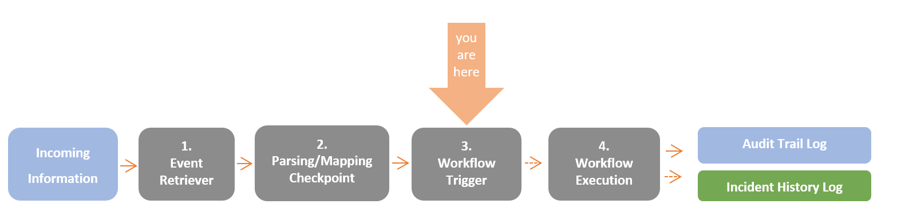
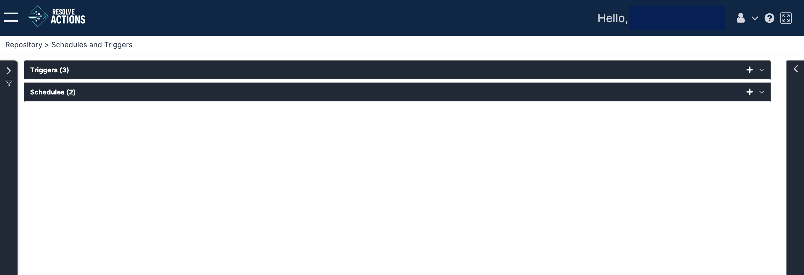

Schedules and Triggers are used to initiate workflows in two ways: conditional triggers and scheduled actions. 

When an event is retrieved by VAR::PRODUCT_FULL, the list of triggers is scanned. If the event matches the criteria of a specific trigger, the workflow assigned to it is initiated.

In addition, workflows may be initiated periodically, according to specific time slot. For example: the workflow "Clean log file folder" can be set to run every Sunday at 2:00 AM.

:::note
For more information on workflows refer to [Welcome to the Workflow Designers](../../../Building-Your-Workflow/introduction.mdx)
:::

Choosing **Repository > Schedules and Triggers** from the Navigation menu opens the following window:

