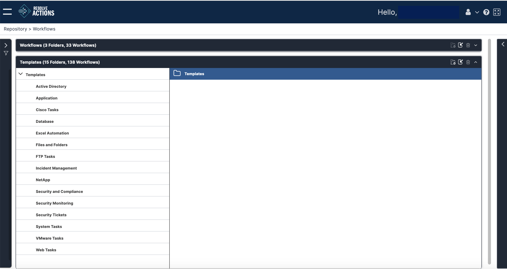

:::note
The treatment here is very brief. Manipulating templates require familiarity with the [Workflow Designer](../../../Building-Your-Workflow/introduction.mdx) where their management is covered in detail.
:::

From the Main Menu, open the **Templates** entity. You will see a list like this:

*   For a new system you are presented with a catalog of pre-installed folders and templates. Notice that the last item, **Security**, contains subfolders.
*   The icons and drop-down action lists are functionally the same as those for workflows.
*   Moving and copying templates follows the same patters as workflows. Copying to a new folder by export import works as expected. You will also need to validate an imported template through the Workflow Designer.
*   In an existing system, your own templates will appear in the catalog under your own folders.
*   The icons and drop-down action lists are functionally the same as those for workflows.
*   Moving and copying templates follows the same patters as workflows. Copying to a new folder by export import works as expected. You will also need to validate an imported template through the Workflow Designer.