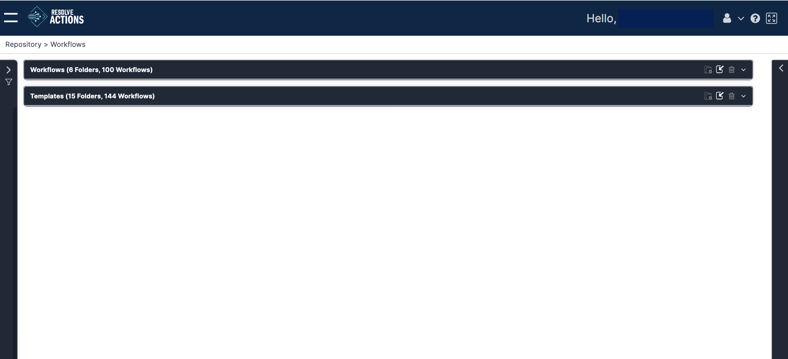
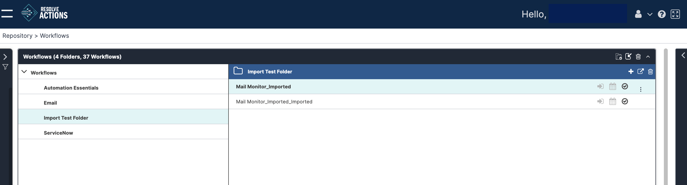
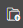
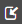
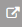
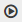
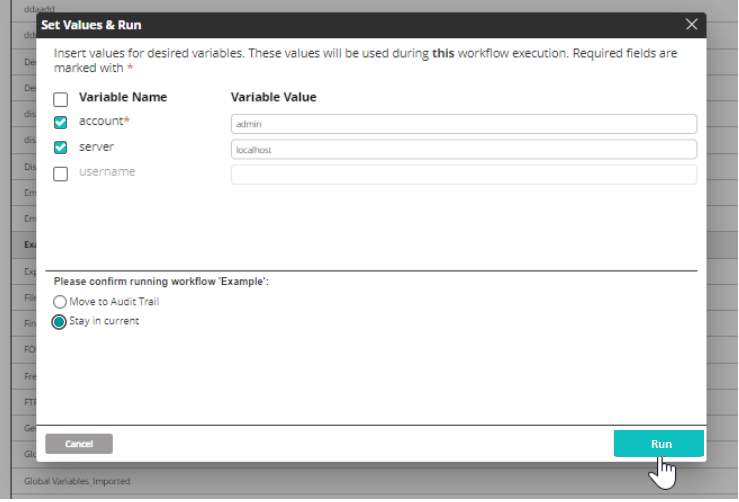
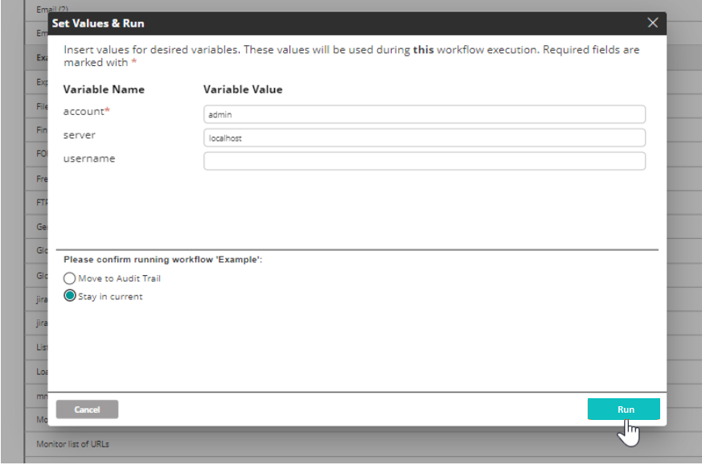

## Managing your Workflows

Navigate to **Repository > Workflows**. You will be offered the following display:

Expand the **Workflows** section. In a new system, the list contains pre-installed workflows. An existing system will also include any that you have added. If you create workflows, consider adding your own folder structure under the default **Workflows**. To create a new folder under the currently selected one, click the New Folder icon. It creates a new folder below the last in the list and invites you to enter a name:

## Moving and Copying Workflows

:::note
The treatment here is brief since it requires familiarity with the [Workflow Designer](../../../Building-Your-Workflow/introduction.mdx) where it is covered in detail.
:::

So far, the workflow catalog behavior is similar to a familiar computer file system. You cannot however, drag and drop workflows between folders. There are two ways to move or copy a workflow to another folder:

To move a workflow to a different folder:

1. Load it into the Workflow Designer.
2. Use the **Save As** option to save the workflow into the required folder.  
   The workflow is moved to the required folder.

To copy a workflow to a different folder:

1. Export the workflow. It will be downloaded by your browser as an XML file.
2. Import it back to the required folder. It will show with the validation icon grayed out:  
   
3. From the action list in ([Operations on Workflows](#operations-on-workflows)), open the workflow in the Workflow Designer and click **Save**.
   The Save action will also validate the workflow and enable the validated indicator icon.

## Operations on Workflows

The toolbar in the Workflow section's header contains the following action icons:

| Icon | Description |
| --- | --- |
| | Add a new folder (see previous section) |
| | Import a workflow to the selected folder. (This applies to a workflow exported from the Workflow Designer or from the workflow list as shown below.) |
| | Delete the selected folder. It is grayed out for the root Workflow folder, but is available for user-defined folders. |

Selecting a workflow reveals its Actions menu (three-dot icon) on the far right. Some of the actions in the list can be accessed from the icons on the top right of the selected workflow as well.

import Admonition from '@theme/Admonition';

| Icon | Description |
| --- | --- |
| | Add an existing workflow to the catalog |
| | Export the selected workflow |
|  | Remove the workflow from the catalog. The workflow is not deleted. |
| | Open the workflow in the Workflow Designer |
| | Run the workflow. Two options are available:    <ul><li><strong>Move to Audit Trail</strong> : After running the workflow, the Audit Trail window opens so that you can watch its progress</li><li><strong>Stay in current</strong>: After running the workflow, you remain in the current Workflows window. Use this option to concurrently run several workflows.</li></ul>  <Admonition type="note">
To run the workflow with variables that have been set by using the <strong>Set Variables</strong> function, see <a href="#running-workflows-with-variables">Running Workflows with Variables</a>.
</Admonition>|

Finally, at the end of each workflow line are three indicator icons:

| Icon | Description |
| --- | --- |
| | Black: Triggered |
| | Black: Scheduled |
| | Black: Valid Gray: Invalid. Check in the Workflow editor |

:::note
For any workflow entry, you may see additional properties by clicking the icon as described in [Using Entity Panels](../../../Product-Navigation/Repository/Repository-Entities/Using-Entity-Panels.mdx).
:::

## Running Workflows with Variables

Once variables have been set (see [Setting Variables in Workflows](../../../Building-Your-Workflow/Variables/set-variables-in-workflows.mdx)), clicking on the **Run** button from **Workflows Repository** will display the **Set Values & Run** window.

Users with editing permissions have the option to select which variables to be used during the workflow execution while users without editing permissions must insert values for all of the required variables to execute the workflow.

### Users with Editing Permissions

User can use the checkboxes on the left side to select which variables will be used during the workflow execution. Variables that have been set as required (marked with \*) can be unchecked if desired.

Clicking on **Run** executes the workflow using the selected variables with their inserted values.

### User without Editing Permissions

User must insert values for the variables that have been set as required (marked with \*). Variables that have not been set as required can be left empty.

Clicking on **Run** executes the workflow using the variables with their inserted values.