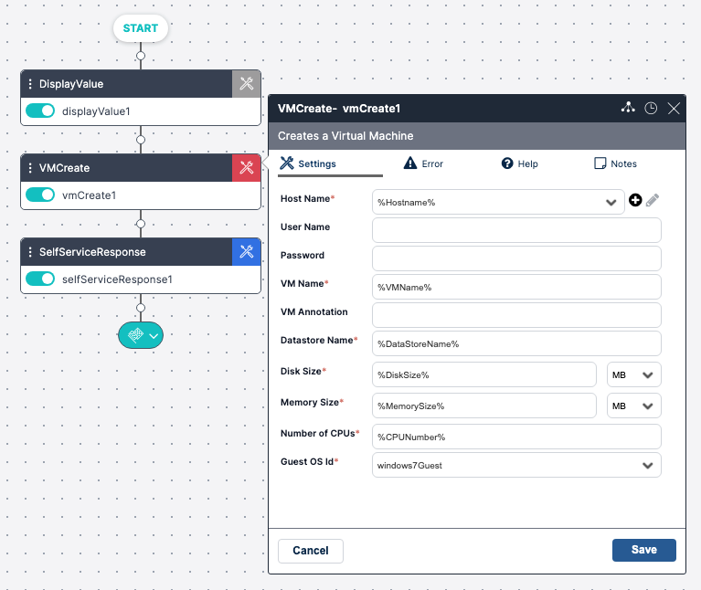
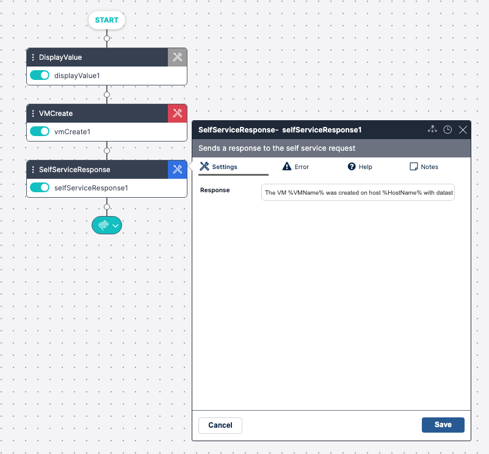

A Self Service Workflow is created in the Workflow Designer. This Workflow will run the automation for the Self Service Form. Refer to the [Building Your Workflow guide](../../Building-Your-Workflow/new-workflows.mdx)

Once you have completed the Workflow, you will link the Workflow to a Self Service Form.

Creating a Self Service Workflow requires the following steps.
1. The Self Service Workflow must contain Self-Service Variables.
2. A Self Service Response Activity.

## Self Service Variables

Self-Service Variables are defined within the Workflow Designer Activity. Self Service variables are visible to the user who launches the Self Service Form and are unique because they are not referenced anywhere else in the Workflow. They must get their value from the Form.  

The example below is a Workflow Activity with variables that will be used in the Self-Service Form.  This activity creates a VM - the following fields are available to be used as Self Service variables:

* Host: `%HostName%`
* VM Name: `%VMName%`
* Datastore Name: `%DatastoreName%`
* Disk Size: `%DiskSize%`
* Memory Size: `%MemorySize%`

:::note NOTE
The following Workflow Variables can NOT be used as a Self Service Variable
* Activity Name
* Memory Set
* Multi Memory Set
* Create Memory Table  
:::

The values for the Self Service Variables will be entered through the Self Service Form. Then the variables values will be passed to the Workflow activity and continue executing the Workflow to create the VM as specified.

## Self Service Response Activity

The Response activity is also created within the Workflow Designer. It will be displayed to the user who completed the Form.

:::note
The Self Service Form can be built without a Response activity, however, this is not recommended. The Form will not provide feedback to the user.
:::

For example:

The following activity is the Self Service Response activity to match the Create VM activity.

The response can include Variable values used in the Create VM activity, providing a better experience for the user. The following example shows the formatted text of a Response Activity.
*The VM `%VMName%` was created on host `%HostName%` with datastore name `%DatastoreName%`. It was provisioned with `%DiskSize%` MB disk size and `%MemorySize%` MB memory.

:::note
The Self Service Response activity can either return text, as shown above, or a table (using a variable), but not both.
:::

## Referencing Form ID or Name in a Workflow

If you want to refer to the ID or Name of a form in your Workflow, you can do so by using one of the following variables

* Form Name: `%SelfServiceName%`
* Form ID: `%SelfServiceID%`

## Referencing User Submitting Form in a Workflow

To see details of the user submitting the Form, use one of the following variables:

* User ID: `%SelfServiceUserID%`
* Username: `%SelfServiceUserName%`
* Full Name: `%SelfServiceUserFullName%`

If the workflow refers to Global Variables or the specific Self Service references to user/form (`%SelfServiceID%`) they will also be populated, and these controls can be deleted.