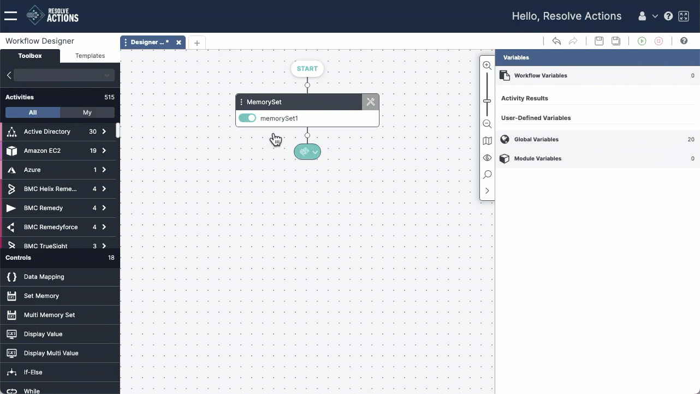

The Search tool lets you find activities by keyword. Results include both activity categories and specific activity types that match the search term. You can then select and add an activity directly from the results. 

 

To add an activity using Search: 

1. Hover over the **white node** where you want to add the activity.
    The white node becomes a **crosshair**.  
2. Click the **crosshair** to add a placeholder.  
3. In the Search field at the top of the placeholder, enter a search term. Matching categories and activities will appear as you type.
4. Click the **activity** that you want to add to the workflow.