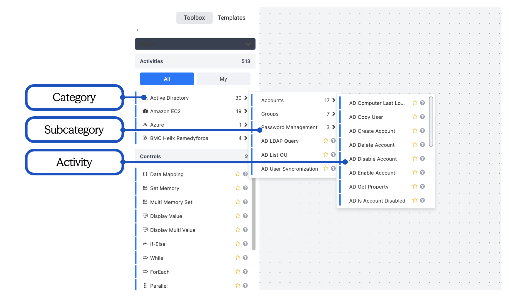

The Activities tree, in the upper-left corner of the Workflow Designer, lists all activity categories alphabetically. Each category shows:

- A unique **icon** (left of the name)
- A **color code** (left of the icon)
- The **number of activities** in that category (right of the name)

When an activity is added to a workflow, its category color appears in the upper-right corner of the activity element, helping you visually identify its origin.

Many categories are divided into subcategories to organize large sets of activities by type. For example, the *Active Directory* category contains 30 activities grouped into subcategories like *Password Management*.

## Adding an Activity

To add an activity from the Activities tree:

1. Expand the category (and subcategory, if needed) to locate the activity.
2. Drag and drop the activity onto the canvas.
   1. Hover over the activity until the crosshair cursor appears.
   2. Drag it to a position marked by crosshair nodes .
      
    If placed incorrectly, simply drag the activity to the correct spot.
3. Configure the activity settings.