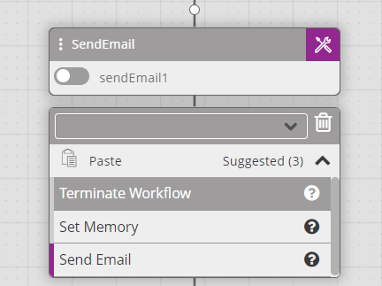
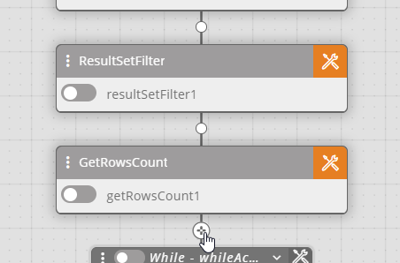
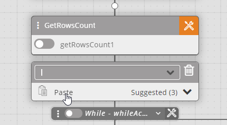
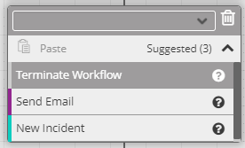

The Suggested Activities list displays up to six recommended activity types based on the content of your workflow. Suggested Activities are context-sensitive, so the activity types that are shown vary according to the preceding activity.

For example, after a **Send Email** activity, you may see suggestions like:

To add a suggested activity:

1.  Hover over the white node where you want to add the activity.  
    The white node becomes a crosshair.  
    
2.  Click the crosshair.  
    A placeholder for a new activity type is added to the workflow.  
    
3.  Click **Suggested** to open the suggestions list.   
    The Suggested Activities list opens.  
    
4.  Select the desired activity to add it to the workflow.