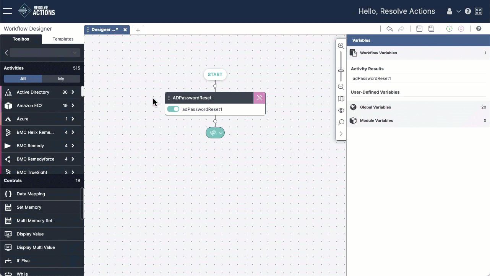

The Paste option lets you insert a copy of an activity or group of activities into a workflow. You can past items copied form the same workflow or another one.

 

To paste an activity:

1. **Copy** the activity or group of activities you want to reuse.
2. Hover over the **white node** where you want to add the activity.  
    The white node becomes a cross-hair.  
3. Click the **crosshair** to insert a placeholder for the activity.
4. Click **Paste** to insert the copied items into the worfklow.