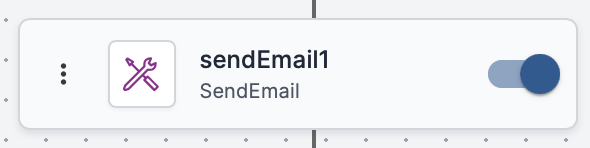
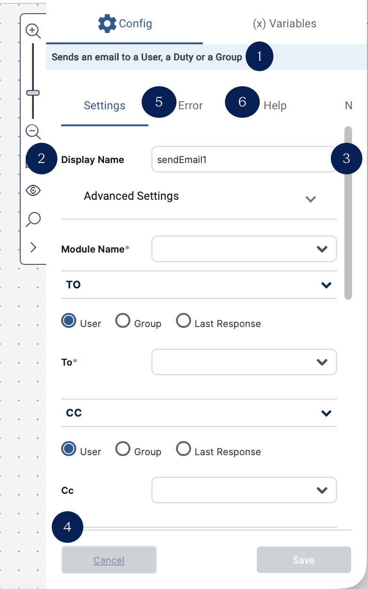
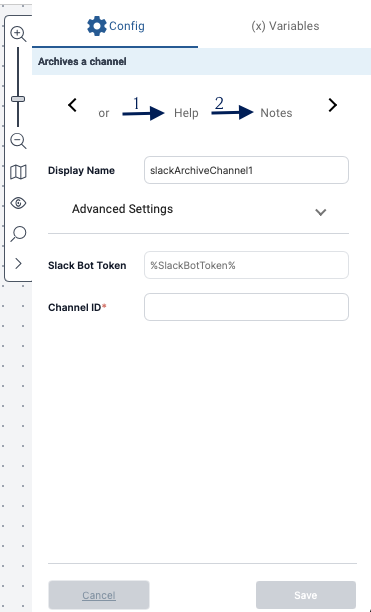
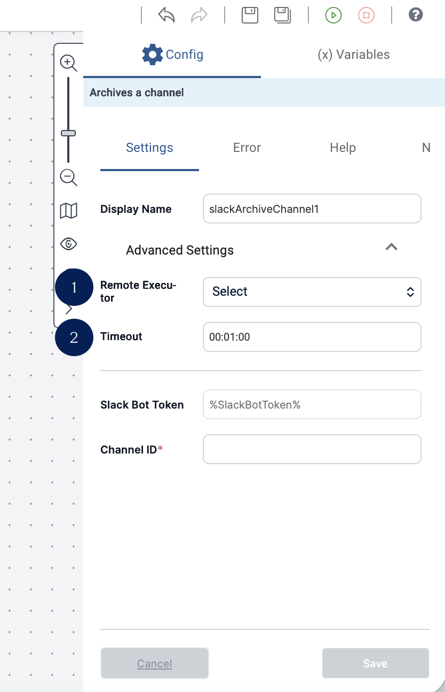

Click anywhere on an activity on the Workflow Designer canvas to open the **Details** dialog.

The **Details** dialog will open on the right side of the canvas and allows you to view and modify key activity parameters, such as implementation settings, timeouts, and error handling. The interface elements are:

1. Activity type—Displays the name of the activity type.
2. Activity instance name—The user-defined name of the activity instance, referred to as **Activity Name** throughout VAR::PRODUCT and this documentation. 
3. Activity instance name editor—Allows you to change the name of the activity instance. For details, refer to [Updating the Activity Instance Name](./update-instance-name.mdx).
4. Close—Closes the Details dialog without saving changes.
6. Error—Allows you to select error handling directions. For more information, refer to [Defining Error Handling](../../../Product-Navigation/Repository/General/Error-Handling.mdx).
7. Help—Displays more detailed information about the purpose of the activity and how to use it.

The top ribbon of the **Details** dialog contains a carousel to navigate to the *Help* and *Notes* options.

1. Note—Allows you to add free text comments. For details, refer to [Adding Notes](../../../Product-Navigation/Workflow-Designer/notes.mdx).
2. Settings—Allows you to configure implementation directions. Settings are displayed by default when the Activity Details dialog opens.

The **Advanced** dropdown in the Details dialog gives options for modifying timeout and the remote executor selection.

1. Executor Module selection—Allows you to select the Executor module the activity will use. See [Selecting an Executor Module](./select-executor-module.mdx).
2. Timeout setting—Allows you to define the period of time after which the activity will automatically abort. For more information, refer to [Setting the Activity Timeout](./set-activity-timeout.mdx).

