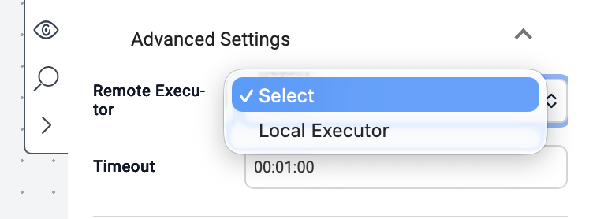

Executors improve workflow performance and scalability by providing load balancing among the servers. An executor can be made up of VAR::PRODUCT_FULL servers, third party servers, or both.

To choose a specific executor for an activity:
1. In the **Activity Details** dialog, click the **Advanced Settings** dropdown.
2. A list of all available executors appears. 
3. Select the desire executor.
4. Click **Save** to apply the change.

:::note
Selecting an executor is optional. If none is selected, the activity will use the default executor configuration. Activities that do not require an executor will not contain this menu item.
:::