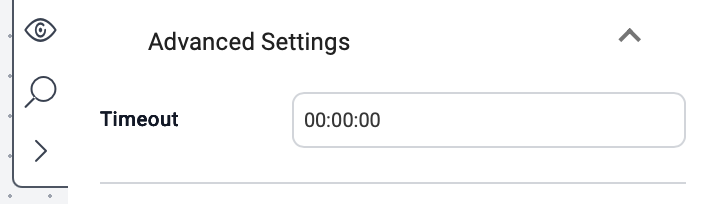

Each activity includes a **timeout setting**. If the activity does not complete within the defined time, it automatically aborts. The default timeout is one minute.

To view or update the timeout:
1. Click the **Advanced Settings** dropdown.
The current timeout value is shown in `hours:minutes:seconds` format.
2. Adjust the timeout value as needed.
3. Click **Save**.

