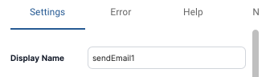

Find the **Display Name** field at the top of the **Details** dialog on the *Settings* tab.

To update the name:
1. Click in the field next to **Display Name**.
2. Enter the new name.
3. Click **Save** at the bottom of the dialog to apply the change.

