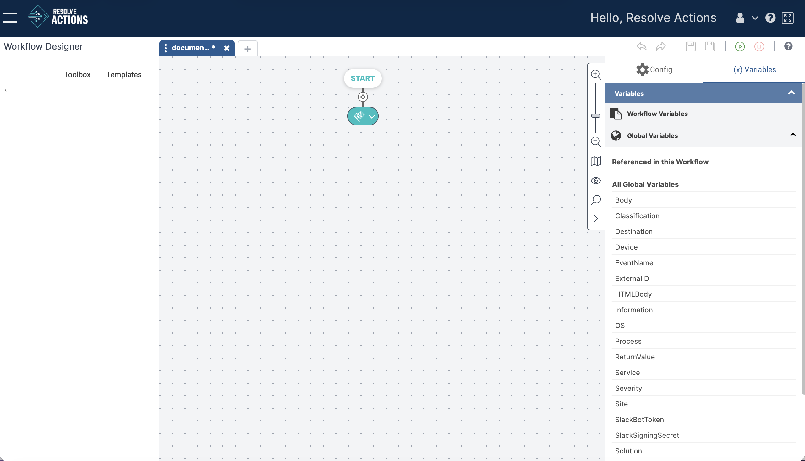

**Create New** adds a blank workflow with Start and End elements.

To create a new workflow:

1.  Click **Create New**.
2.  Enter a logical, descriptive name in the **Workflow Name** field.
    If you enter a name that is already in use, the system will automatically save the workflow as `<name> (1)`.
3.  Choose a **Folder** (default: **Workflows**).
    :::note
    You can create new folders. In the Repository section, see [Workflows](../../Repository/Workflows-and-Templates/Workflows.mdx)
4.  Add a **Description**.
5.  Optionally, assign **Tags** to help organize and search workflows.
    See [Adding Tags to a Workflow](./add-tags.mdx).
6.  Click **Create**.  
    
    

