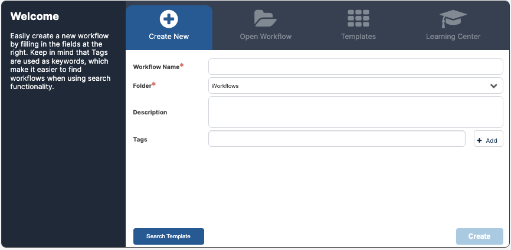
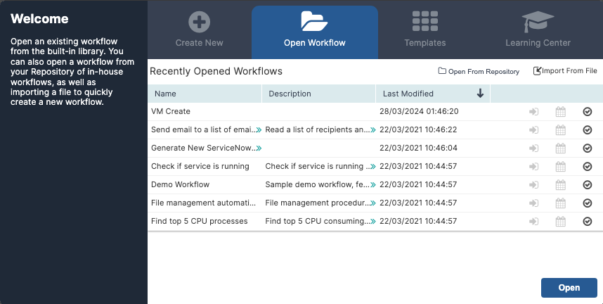
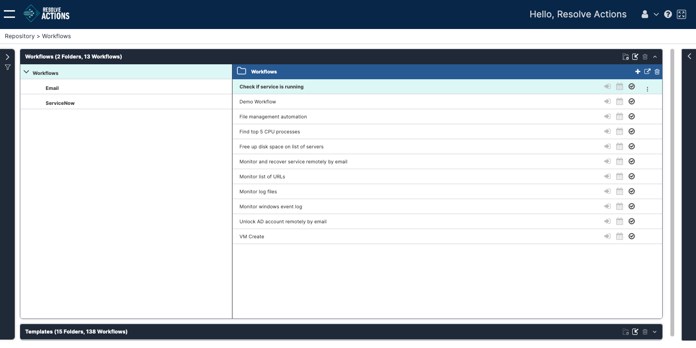

To start using the Workflow Designer, open a workflow from the **Welcome** screen.

If no workflows are open when you log in, the **Welcome** screen appears by default. To open it manually, click the plus icon next to the workflow tabs.

Available options:

*   **Create New:** Start with a blank worfklow. See [Creating a New Workflow](./create-new-workflow.mdx).
*   **Open Workflow:** Resume editing a saved workflow. See [Opening an Existing Workflow](#opening-an-existing-workflow).
*   **Templates:** Use a pre-built workflow as a starting point. See [Opening a Template](./open-template).

## Opening an Existing Workflow

### Locating Existing Workflows

You can open saved workflows in three ways: 

*   **Recent Workflows:** Use the **Welcome** screen. See [Re-opening a Recently Opened Workflow](#re-opening-a-recently-opened-workflow)
*   **Repository:** Use the full list of saved workflows. See [Opening a Workflow from the Repository](#opening-a-workflow-from-the-repository).
*   **Import File:** From a previously exported XML file. See [Importing a Workflow](./import-workflow.mdx).
    
### Re-opening a Recently Opened Workflow

From the **Welcome** screen, click the **Open Workflow** tab and select a workflow form the recent list (max 10). Double-click or click **Open**.
    

    

### Opening a Workflow from the Repository

1.  In the **Open Workflow** tab, click **Open From Repository**.  
  The **Workflows** frame of the Repository opens.  
  
2.  Select a folder in the left pane.
3.  Choose a workflow in the right pane to see its details.  
    
4.  Click the three-dot actions menu in the upper right corner and select **Open**.  