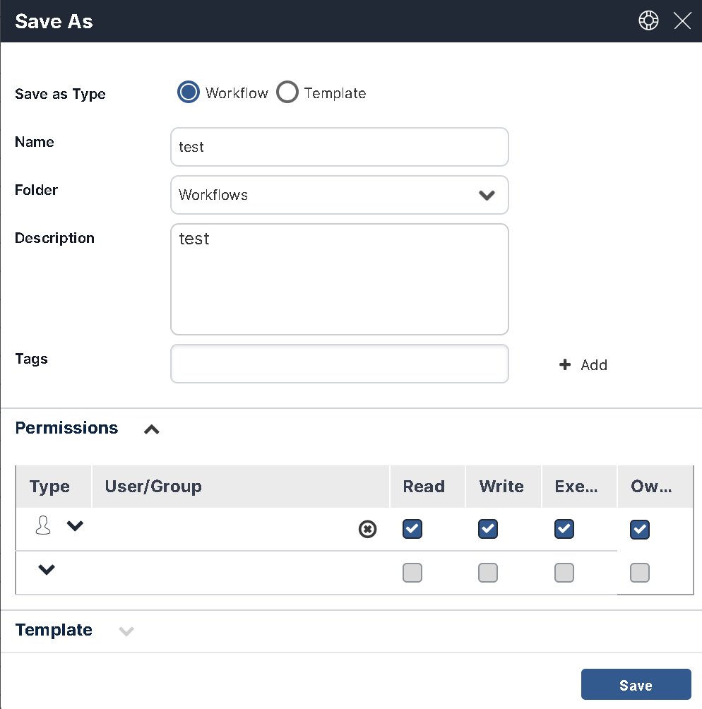

## Saving Your Workflow 

### Save Options

The Workflow Designer provides two save options:

*   **Save:** Saves all changes made since the last save. See [Using the Save Action](#using-the-save-action).
*   **Save As:** Creates a new workflow or template based on the current one. See [Using the Save As Option](#using-the-save-as-option).
    
Both options are available from the icon action bar:

### Using the Save Action

Click the save icon

to preserve your recent changes. 

The Workflow Designer does **not** auto-save. Save your work frequently to avoid losing changes.

If you try to close a workflow without saving, you'll be prompted to do so. 

### Using the Save As Option 

Use **Save As** to duplicate a workflow or convert between a workflow and a template.

Click the **Save As** icon  to open the dialog:

Then:

1. Choose whether to save as a **workflow** or a **template**.
2. Update the **Name** and **Description**, if needed.
3. Add or remove **Tags**. (See [Adding New Tags](./add-tags.mdx).)
4. If saving as a workflow, set **Permissions**. (See [Assigning Permissions to a Workflow](../workflow-settings.mdx).)
5. If saving as a template, you can optionally change the template image.
6. Choose whether to **Create a new revision.**

This option may be locked if the workflow is in use (e.g., in production).

7. Click **Save** to finish.

