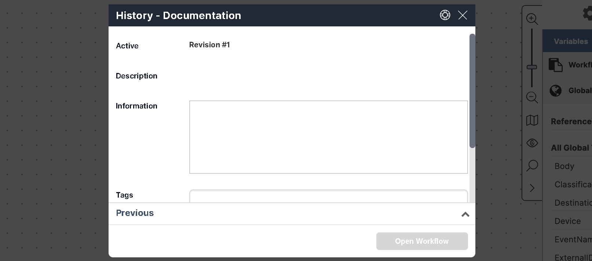

## Viewing Revision History 

### About Revision History

The Workflow Designer supports version control by letting you create and manage multiple revisions of workflows and templates. (See [Saving Your Workflow](./save-workflow.mdx) for how to create revisions.) 

To see the revisions history: 
- Click the three-dot menu next to a workflow or template. 
- Select **History** to open the History dialog.

### Understanding the Latest Revision

The top section of the **History** dialog shows data about the most recent (Active) revision, even if it is not currently open. 

Details include:

* **Name**Title of the Active revision.
* **Active**—Revision number.
* **Description**—Summary of changes or notes.
* **Information**—Additional content in Rich Text Format (RTF).
* **Tags**—Keywords for organization and search.
* **Saved**—Timestamp of the last save.
* **Previous** (Click the expand arrow) Previous revisions.

### Viewing and Opening Previous Revisions

To view earlier versions:

1. Expand the **Previous** frame at the bottom of the **History** dialog.
2. Click a revision number to view details.
3. Click **Open Workflow** to open it in the Workflow Designer.

When a revision other than the Active revision, the revision number is displayed as part of the name in the workflow tab.

:::note
If you have closed the Active revision, you cannot reopen it from the **History** tab. Open it by selecting it from the [list on the Welcome screen](../../../Product-Navigation/Workflow-Designer/workflow-dashboard.mdx).
:::
