## Basic Concepts

A workflow is a sequence of activities performed according to a logical flow. In most cases, a workflow represents a series of events carried out in response to a specific event or incident. When you design a workflow, build it according to how you would normally handle the incident in your organization, and select the activities that best match your policies and procedures.

On the canvas of the Workflow Designer, a workflow is made up of all the components between the Start and End elements. These components fall into two categories:

*   **Activities:** Operative actions that are the building blocks of the workflow process. Every activity returns a value (i.e., integer, string or ResultSet). For example, a Get Disk Space activity returns an integer. An activity's returned value is generally used to determine the next step(s) in the workflow. For example, if Get Disk Space returns a low value, you may want to clear some disk space.
*   **Controls:** Special types of activities that are usually (but not always) logic functions or decisions that determine how the workflow will proceed. For more information and examples, refer to [Understanding Common Controls](#UUID-4e963a37-d0da-c734-1985-86b154fad21e).

The diagram below shows the typical structure of a workflow. Activities are distinguished by a description and a color-coded symbol corresponding to the color of the relevant activity category in the [Activities Tree](#UUID-861a226e-e096-f19b-6a49-0c20aa343001). Controls are not color coded, and those that have no configurable settings lack a description.

Note that the structure of a workflow is linear, with the exception of If/Else controls that send the workflow in one of two or more paths.

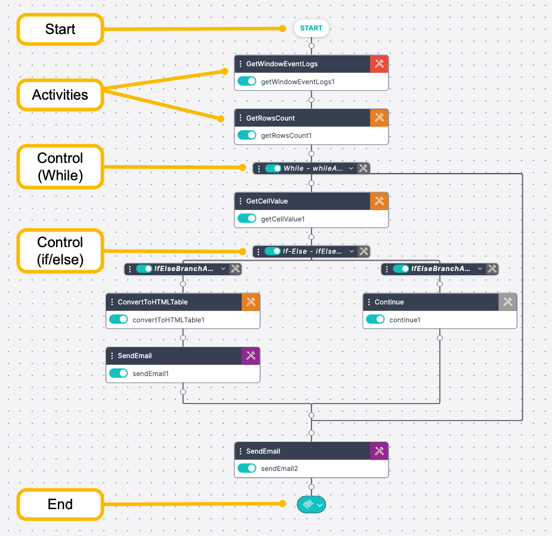

The following sections present more detailed information on how to build your workflow:

*   [Adding Activities](#UUID-861a226e-e096-f19b-6a49-0c20aa343001)
*   [Understanding Common Controls](#UUID-4e963a37-d0da-c734-1985-86b154fad21e)
*   [Editing Activities](#UUID-2b7861d9-b42d-41b6-472a-15aae2f9d708)
*   [Performing Actions on Activities](#UUID-3998d9c3-3d37-2a10-7a0d-b366a53503ef)
*   [Building Workflows: Best Practices](#UUID-ceced0cb-8cf3-e123-9f14-4df718649b6c)
    

## Understanding Common Controls {#UUID-4e963a37-d0da-c734-1985-86b154fad21e}

### Common Controls

Controls are activities that influence or determine the progression of a workflow by means of conditions, logic functions, or navigation instructions. The list of available controls is displayed on the left side of the Workflow Designer, under the [Activities tree](../Workflow-Designer/Workflow-Designer-Overview.mdx). You can add controls to your workflow using most of the methods used to add activities. For more information, refer to [Adding Activities](#UUID-861a226e-e096-f19b-6a49-0c20aa343001).

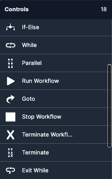

The following topics explain how to use and create common controls:

*   [If/Else](#UUID-27d36382-55de-746f-6469-639f9244cff6): Defines two or more conditions which are evaluated to determine the activity sequence that will take place next.
*   [While](#UUID-9d9b9c7c-c4ba-349e-0d56-44daba9a45ee): Designates one or more activities to be part of a loop.
*   [Parallel](#UUID-8d818eb9-e005-cf79-599c-c1bf93307d95): Defines two or more activities (or sets of activities) that are executed simultaneously.
*   [Run Workflow](#UUID-b2320e34-3ceb-c858-734a-c75ebe76b948): Inserts a nested (child) workflow into the main workflow.
*   [Goto](#UUID-5a42aacc-3f9d-48f1-2526-6f3f0c89cb4e): Designates a shortcut to a selected activity in the workflow.
    
### If/Else: Evaluating Multiple Conditions {#UUID-27d36382-55de-746f-6469-639f9244cff6}

An If/Else control is made up of two or more branches, each of which defines a condition. When the workflow is run, each condition is evaluated, and the workflow then continues according to the sequence of activities specified by the matching branch.

In the following example, an If/Else control follows a ping command activity. If the ping is successful, the system sends an email with the message Server Up. If the ping fails, the system sends an email with the message _Server Down. Please Check_.

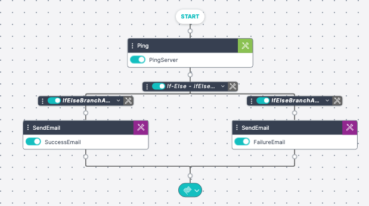

When workflows are executed, If/Else branches are checked sequentially, from left to right. As soon as a matching condition is found, the workflow progresses according to that branch, and the remaining branches are left unchecked. One branch, usually the right-most branch, is always designated as a default. If none of the conditions match, the workflow continues by executing the activities within the default branch.

#### If/Else Branch Types

You can create three types of If/Else branches in the Workflow Designer. The branches differ from one another in the nature of the conditions they define. The branch types are:

*   **Predefined:** This type lets you choose from a list of common yes/no values, such as True, False, Response, No Response, and so on.  
*   **User Defined:** This type lets you select a condition category (Equals, Contains, etc.) and then define your own value. The value can be hard-coded or it can be a variable defined by another activity.  
*   **Condition:** This type lets you select from a list of predefined system conditions, or create a new system condition.  

To create an If/Else control:

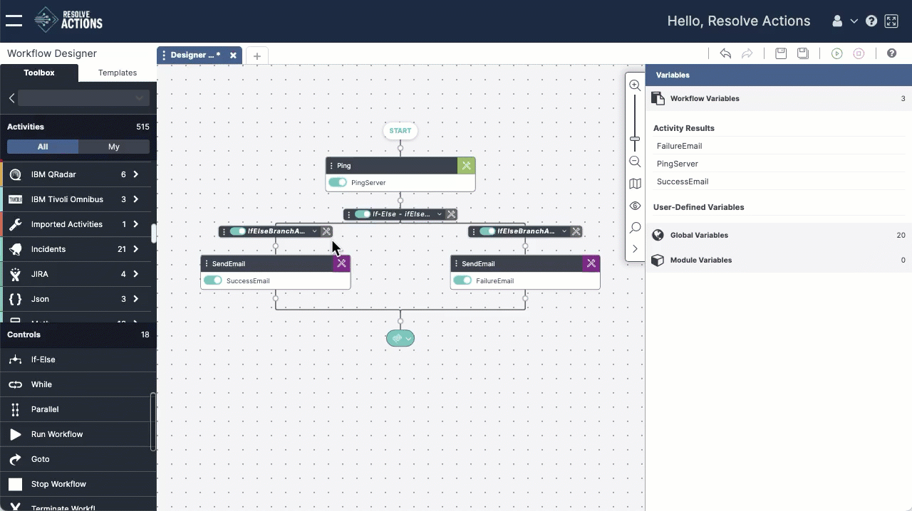
1.  From the list of controls on the left side of the Workflow Designer, select the If/Else control and drag it to the desired position in the workflow. For more details, refer to [Adding Activities](#UUID-861a226e-e096-f19b-6a49-0c20aa343001).  
    The control is added to the canvas containing two branches.  
2.  From the upper right corner of one of the branches, click the **Settings** icon
    The **Settings** dialog box appears.
3.  From the **Type** drop-down, select the required type.  
4.  In the **Value** and/or **Condition** field(s), specify the required value or condition, according to the selected type.
5.  Click **Save**.  
    The **Settings** dialog closes.
6.  Repeat steps 2-5 to define settings for the second branch of the control.
7.  To add another branch to the control, on the left side of the control, click the three-dot menu and then select **Add Branch**.
8.  Define the settings for the new branch.
9.  To reorder the branches, on the left side of a branch, click the three-dot menu and then select **Move Left** or **Move Right,** as required.    

### Executing Activities in Parallel {#UUID-8d818eb9-e005-cf79-599c-c1bf93307d95}

A Parallel control is made up of two or more branches. A Parallel control is a useful time saver when the order of performing multiple activities is not significant (e.g., checking the status of devices).

*   The branches of a Parallel control are usually made up of sequences of activities and do not normally evaluate conditions like an if/else control. 
*   The branches of a Parallel control run simultaneously (in parallel). 
    
The following example shows a Parallel control whose branches return the values of numbers. Note that when the workflow runs, each activity within a branch runs in sequence. However, the branches all run at the same time.

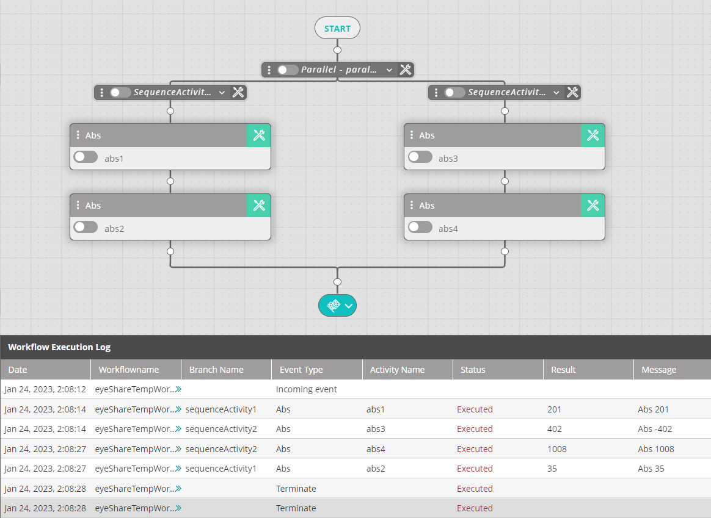

To create a Parallel control:

1.  From the list of controls on the left side of the Workflow Designer, select the Parallel control and drag it to the required position in the workflow. For more details, refer to [Adding Activities](#UUID-861a226e-e096-f19b-6a49-0c20aa343001).  
    The control is added to the canvas together with two branches.  
    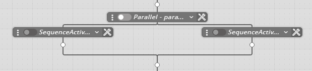
2.  Build the activity sequence of the first branch by [adding the relevant activities](#UUID-861a226e-e096-f19b-6a49-0c20aa343001) to the canvas and [defining their settings](#UUID-2b7861d9-b42d-41b6-472a-15aae2f9d708). An activity sequence can be as short or as long as necessary (i.e., from one activity to many activities).
3.  Repeat Step 2 to build the activity sequence of the second branch.
4.  If necessary, add more branches to the Parallel control:  
    On the left side of the control, click the three-dot menu and then select **Add Branch**.  
    Then, build the activity sequence(s) of the additional branch(es).

### While: Inserting a Loop in Your Workflow {#UUID-9d9b9c7c-c4ba-349e-0d56-44daba9a45ee}

A While control starts a loop in the workflow. The loop can contain any number of activities. A loop counter determines how many times the While activity runs. 
The following example shows a loop that is made up of multiple activities.

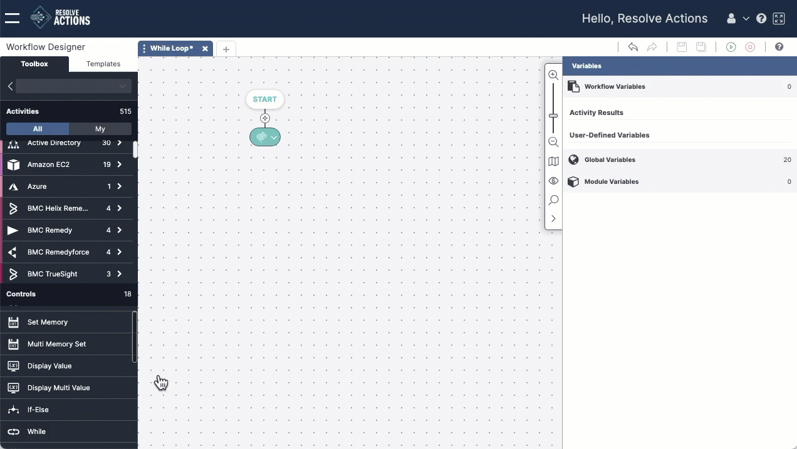

To create a While control:

1.  From the list of controls select the **While** control and drag it to the required position in the workflow. 
    :::note 
    The control is added to the canvas, together with a line that represents the exit point of the loop. Activities added above this line are included in the loop. Activities added below the line are not part of the loop.  
    :::
2.  Build the activity sequence of the loop by [adding the relevant activities](#UUID-861a226e-e096-f19b-6a49-0c20aa343001) to the canvas and [defining their settings](#UUID-2b7861d9-b42d-41b6-472a-15aae2f9d708).
3.  On the right side of the While control, click the **Settings** icon  to configure the While control. 
4.  In the **Counter** field, enter the value of the counter.  
    :::note 
       The value can be hard-coded or it can be a variable defined by another activity.
    :::
5.  Click **Save**.  

### Calling a Nested Workflow {#UUID-b2320e34-3ceb-c858-734a-c75ebe76b948}

The Run Workflow control inserts a nested (child) workflow into the workflow. This control is useful for quickly and easily incorporating frequently used processes into your main workflows. In addition, you can run the nested (child) workflow with variables, which is ideal when the variable in the parent workflow is dynamic – as is the case when running a loop – and those changes need to be captured and used in the child workflow as it runs in the background.

To create a Run Workflow control:

1.  From the list of controls on the left side of the Workflow Designer, select the Run Workflow control and drag it to the required position in the workflow. For more details, refer to [Adding Activities](#UUID-861a226e-e096-f19b-6a49-0c20aa343001).  
    The control is added to the canvas.
2.  From the upper-right corner of the control, click the Settings icon .  
    The **Settings** dialog box appears.  
    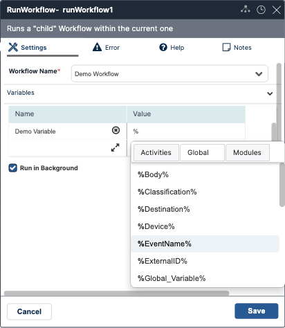
3.  Click in the **Workflow Name** field, and select the required child workflow.
4.  If you want to run the child workflow with variables, enter the variables under the **Variables**.
    * The **Name** is the variable's name to be referenced (the name must differ from the activity's name and must start with a letter and contain only the A-Z, a-z, 0-9 characters).
    * The **Value** is the variable's value - a constant value or another variable (variable names must follow the convention `%Variable%`). Note that it is not possible to send both text and a variable in the same field (i.e., `getrowscount(%tablename%)`).  

    :::note
    The variable passed to the child workflow is a copy of the variable in the parent workflow, meaning that changes made to the variable in the child workflow will not be reflected in the parent workflow.
    :::
5.  If you want to run the child workflow asynchronously (i.e., the main workflow continues while the child flow is running), select the **Run in Background** checkbox.
6.  Click **Save**.  
    Settings are saved in the system.

### Goto: Setting a Navigation Shortcut {#UUID-5a42aacc-3f9d-48f1-2526-6f3f0c89cb4e}

The Goto control interrupts the normal linear progression of a workflow by redirecting the flow to a specific activity elsewhere in the workflow. Once that activity is completed, the flow does not return to the point of interruption, but progresses linearly from the activity to which it was redirected.

The activity to which the flow is redirected may be at any location in the workflow. If the activity is located before the point of redirection, a portion of the workflow is repeated. If it is located after the point of redirection, a portion of the workflow is skipped.

To create a Goto control:

1.  From the list of controls on the left side of the Workflow Designer, select the Goto control and drag it to the required position in the workflow. For more details, refer to [Adding Activities](#UUID-861a226e-e096-f19b-6a49-0c20aa343001).  
    The control is added to the canvas.
2.  From the upper right corner of the control, click the Settings icon .  
    The **Settings** dialog box appears.
3.  Click in the **Go to Activity** field, and select the activity to which the flow should redirect.
4.  Click **Save**.  
    Settings are saved in the system.

## Defining and Editing Activity Parameters {#UUID-2b7861d9-b42d-41b6-472a-15aae2f9d708}

### Hiding Activity Results in Execution Logs {#hiding-activity-results-in-execution-logs}

In VAR::PRODUCT, you can mask activity results in the **Workflow Execution Log** of the Workflow Designer and in the [Activity Log](../../Product-Navigation/Insight/Audit-Trail/viewing-the-audit-trail-log.mdx) of the **Audit Trail** while simultaneously being able to use them in the next activities of the workflow. Masking helps you prevent disclosing sensitive information in case a wider audience has access to the logs. It can also help keep performance high when you expect the activity results to be large.

To mask the activity result, add the `[hide]` text in any of the editable fields of the activity settings before or after the input value, separated by space.

Let's take the following example with the Get Date activity, here showing future time in the selected format and time zone.

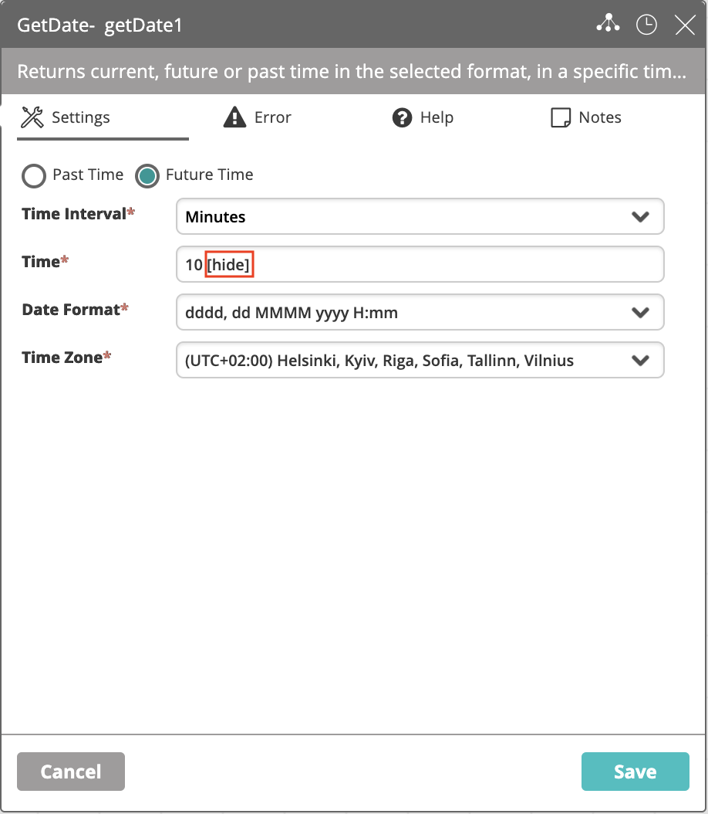

The result in the **Workflow Execution Log** and in the **Audit Trail** will be masked using asterisks:

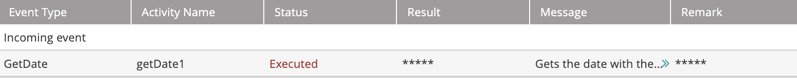

### Defining Error Handling {#UUID-d8c7e098-da7c-68cb-4865-3a993ea4cda6}

### Adding Notes {#UUID-307e6ece-151c-b40f-c886-f4efc77cdb1d}

The **Notes** tab of the Activity Details dialog lets you write comments about the activity. It is recommended that notes be entered about each activity. Notes can contain a description of the activity, a summary of its logical place in the workflow, and any other relevant information that would be valuable to share.

To create or update a note, enter the text in the field, and then click **Save**.

All notes created for a workflow are displayed at the bottom of the **Documentation** dialog for that workflow. For more information about the **Documentation** dialog, refer to [Reviewing Workflow Metadata](id::reviewing-and-sharing-workflows#UUID-ecda282f-eb43-e8a9-2aa5-77bad263977e).

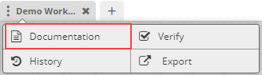

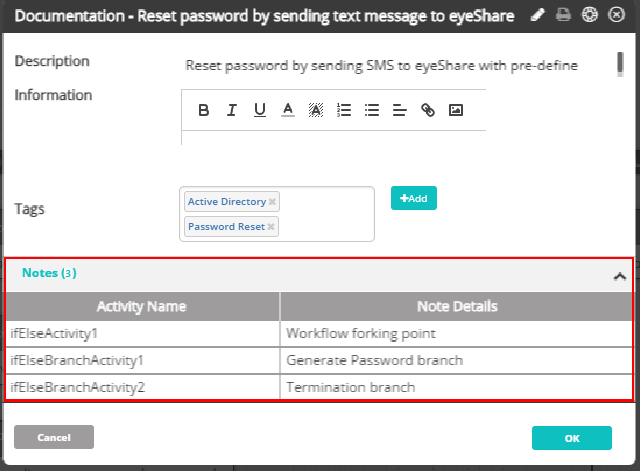

## Performing Actions on Activities {#UUID-3998d9c3-3d37-2a10-7a0d-b366a53503ef}

### About Actions on Activities

### Disabling Activities {#UUID-b64c1bf6-de2a-9dc4-0bd8-5edeac222d41}

### Pasting Activities {#UUID-942d43a9-0fb9-47de-4590-4e49374c9e35}

### Deleting Activities {#UUID-7460ae4b-1498-650b-9083-6526f28f059a}

    
## Working with Selection Mode and Groups {#UUID-76e004db-6797-8639-b585-c2ea19d40281}

### About Selection Mode and Groups

To maximize efficiency, the Workflow Designer is equipped with the following features that allow you to consolidate actions and divide your workflow into logical sections:

*   **Selection mode:** Lets you select one or more activities in a workflow. Selection mode enables you to perform actions on multiple activities simultaneously. You can also designate a set of consecutive selected activities as a Group.
*   **Groups:** Sets of consecutive activities on which you can perform collective operations and write notes. A group can also have its own set of error handling rules. For more information, refer to [Working with Groups](#UUID-16b4808e-d365-d20e-a11a-24f7cd03581d).
    
### Using Selection Mode

### Performing Actions on Selected Activities

### Working with Groups {#UUID-16b4808e-d365-d20e-a11a-24f7cd03581d}

    
## Creating a Data Flow

As activities run one after the other, they produce data. It can be a simple "success" or "failure" indication, or something more substantial such as a file content, a database record, or a user account name.

In most cases, you will want to pass this data from activity to activity down the workflow to do extra processing, to display it, to store it, or to send it out. In VAR::PRODUCT, passing data between activities is done using variables. In the case of the [Run Workflow](../../Activity-Repository/Controls/run-workflow.mdx) activity, variables also allow you to pass data from the parent workflow to the child and back.

The types of variables that you can use in your workflows include:
* [Workflow Variables](#workflow-variables)
* [Global Variables](#global-variables)
* [Module Variables](#module-variables)

### Workflow Variables {#workflow-variables}

#### Activity Result Variables

### Using the Variables Pane

W

### Global Variables {#global-variables}

### Module Variables {#module-variables}

### Scope Precedence

VAR::PRODUCT allows you to have same-named variables in the global and the workflow scope. To avoid unexpected outcomes, VAR::PRODUCT puts precedence on the workflow variable when it finds a reference to such a variable name in an activity.

Assume you have a global variable named `StudiedAnimal` set to `rabbit`. If you create a simple workflow with just the **DisplayValue** activity and reference it, it will print out `rabbit` in the execution log.

Now let's add a **MemorySet** activity in front of **DisplayValue** and set it to create a workflow variable with the same name and set it to `hare`:

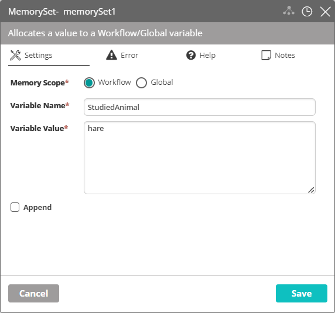

After you execute the updated workflow, **DisplayValue** will print out `hare` instead of `rabbit` as the local variable takes precedence over the global.

## Building Workflows: Best Practices {#UUID-ceced0cb-8cf3-e123-9f14-4df718649b6c}

Making the right design decisions can have a positive effect on your workflow's performance and usability. Below you can find a collection of design best practices to apply in the **Workflow Designer**.

*   Limit workflows to 100 activities or fewer. When use cases require more than 100 activities, split actions into child workflows through the **Run Workflow** activity.
*   Before migrating the workflow to production, eliminate unnecessary activities used in testing and logging (such as the **Display Value** activity).
*   The **Display Value** activity is intended for debugging or writing results to the audit trail and must never be used as a variable where it is referenced as an input for another activity.
*   Identify any repeating sections of the workflow design, take them out as child workflows, and reuse them.
*   Use get cell value formulas when working with a large result set outputs instead of using multiple **Get Cell Value** activities.
*   Update activity instance names to provide the context of the generated output.
*   Include **If-Else** branches at critical points for visual error handling.
*   Include notes into activity settings and/or within the workflow document describing the actions taken.
*   Limit workflows to no more than five parallel branches.
*   [Group](#UUID-16b4808e-d365-d20e-a11a-24f7cd03581d) workflow sections for ease of navigation (you can collapse and expand them) and add notes to describe the function of the group.
*   When you expect the activity results to be large, use the [\[hide\]](#hiding-activity-results-in-execution-logs) feature to eliminate logging raw result output into the database.
*   Define the appropriate timeout setting for activities with external or time-sensitive actions (SSH activities, the various database query types and statements, **Executor**, **Read File**, and so on) by clicking the clock icon in the title bar. The default timeout is one minute. Based on the type or size of the result, it may require increasing the value.