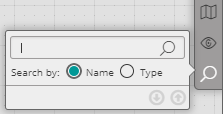
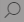

To locate activities using the Search tool:

1.  From the Reference toolbar, click the magnifying glass icon .  
    The **Search Activity** popup opens.
2.  In **Search by**, select whether you want to search by name or by type.
3.  Enter your keyword in the field above the radio buttons.
    * As you type, the name and type of the first component that matches the keyword is highlighted in the workflow diagram.
    * If more than one component in the workflow matches the keyword, the total number of matches is listed at the bottom of the **Search Activity** popup. You can jump to the next or previous match by clicking the Up/Down arrow icons.