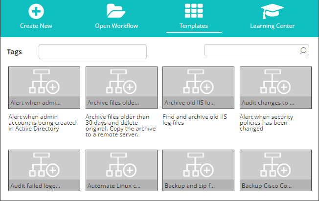
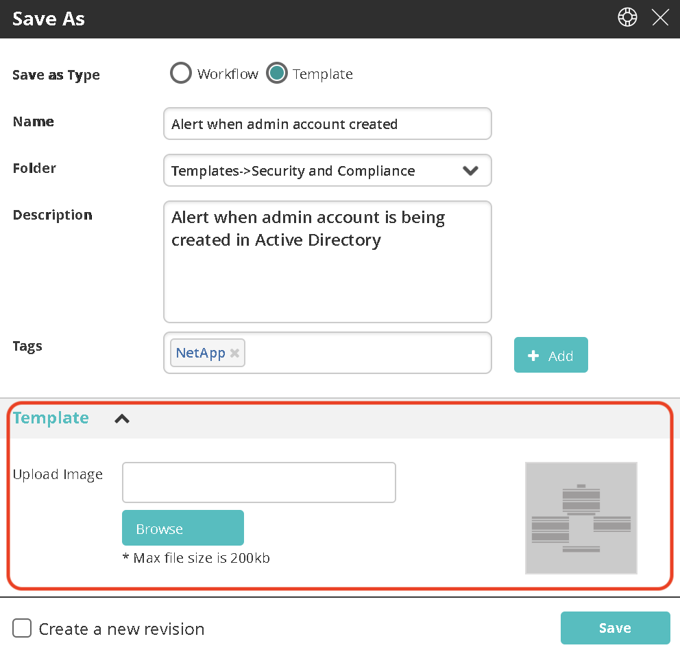
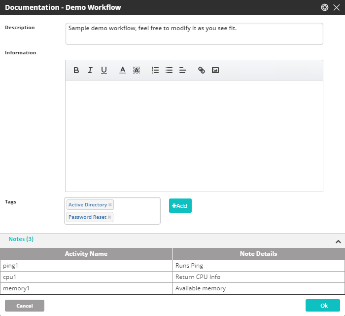
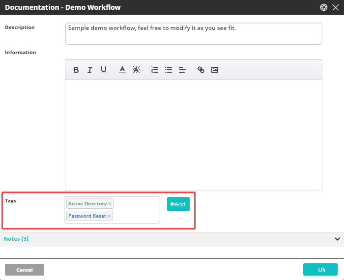

## About Reviewing and Sharing

The following sections present options that help you save workflows efficiently, access the revisions you need, and keep track of workflow metadata:

*   [Saving Your Workflow](#UUID-56586f3e-d54b-efa7-beed-9c9dffe2c3ac): Explains the options for saving workflows and creating new revisions.
*   [Viewing Revision History](#UUID-d0ab0bd1-c7de-f099-2b4a-35227cd2174c): Describes how to view the revisions of a workflow and open the required revision.
*   [Reviewing Workflow Metadata](#UUID-ecda282f-eb43-e8a9-2aa5-77bad263977e): Describes the **Documentation** dialog, which lets you review workflow descriptions, tags and notes.
*   [Exporting Workflows](#UUID-8da5663b-a1ff-c2ac-bc2c-5f6c6b7ab66a): Explains how to download a workflow in XML format.
    

### Selecting an Image for a Template

Every template has an identifying image associated with it. These images appear in the thumbnails displayed on the [Templates tab of the Welcome screen](../Workflow-Designer/Working-with-Workflows.mdx). By default, a template's image is a representation of its [Minimap](../Workflow-Designer/navigating-through-your-workflow).

The **Template** frame of the **Save As** dialog displays the currently selected image for the template, and allows you to replace the current image with one of your choice.

To select a new image for a template:

1.  At the right side of the **Template** frame, click **Browse**.  
    The **Open** dialog is displayed.
2.  Navigate to and select the required image. Then, click **Open**.  
    The **Open** dialog closes, and the image in the **Template** frame is replaced with the selected image.

## Reviewing Workflow Metadata {#UUID-ecda282f-eb43-e8a9-2aa5-77bad263977e}

### About Workflow Metadata

The **Documentation** dialog displays the following data about a workflow:

*   [Description and information text](#UUID-563343ac-7fd9-6a31-34ae-cac5c2560e42): Workflow summary or other useful messages about the workflow.
*   [Tags](#UUID-d0777369-8719-f65e-9ef4-3cc73ef44923): Keywords that enable users to easily categorize and locate workflows.
*   [Notes](#UUID-ee297552-53b8-a145-377d-d9b42af42376): Information relevant to a specific activity in the workflow  

    
### Accessing the Documentation Dialog

To open the **Documentation** dialog, on the left side of the relevant [workflow tab](../Workflow-Designer/Working-with-Workflows.mdx), click the three-dot menu and select **Documentation**.

### Reviewing Description and Information Text {#UUID-563343ac-7fd9-6a31-34ae-cac5c2560e42}

The upper portion of the **Documentation** dialog shows the following data (if it has been defined):

*   **Description:** Generally summarizes the workflow purpose and provides use cases or other relevant information
*   **Information:** An additional message about the workflow written in HTML.

To modify the description and/or information text:

1.  Click in the **Information** area and type free-text.
2.  Update or add text as desired. Use the standard Information icon bar to provide local formatting.
3.  To save your changes, click **OK**.

### Managing Tags {#UUID-d0777369-8719-f65e-9ef4-3cc73ef44923}

Tags are keywords that help to organize and easily search for workflows. You may add and delete tags for a workflow from the **Documentation** dialog.

For more information about tags and how to create them, refer to [Adding New Tags](../Workflow-Designer/Working-with-Workflows.mdx).

:::note
After managing tags, be sure to click OK to save your changes.
:::

### Viewing Notes {#UUID-ee297552-53b8-a145-377d-d9b42af42376}

A note is supplementary information written for a specific activity or control within a workflow. For details about how to add and work with notes, refer to [Editing Activities](../Workflow-Designer/Building-Your-Workflow.mdx).

The lower portion of the **Documentation** dialog is a record of all notes contained in a workflow. The number to the right of the **Notes** frame title indicates the total number of notes in the workflow. The grid that follows lists the activities that contain notes (in the order in which the activities appear in the workflow), and the actual text of each note.

## Exporting Workflows {#UUID-8da5663b-a1ff-c2ac-bc2c-5f6c6b7ab66a}

The Export feature lets you download a workflow in XML file format. Use this feature to review the XML structure, share the file with others, or keep a backup of the workflow.

### Export Format

The export can contain one or more workflows, stored as XML files named `<Workflow name>.xml`. In addition, each export contains a file named `workflows_export_summary.xml`. You can disregard this file when importing individual XML files.

To export a workflow from the Workflow Designer:

1.  Ensure that the workflow is opened in **Workflow Designer**.
2.  On the left side of the workflow tab, click the three-dot menu and select **Export**.  
    The workflow is exported to your local computer as a ZIP archive format.

To export one or more workflows from Repository:

1.  Go to **Main Menu > Repository > Workflows**.
2.  Select one or more workflows in the list.
3.  Click the **Export selected workflows** icon.
    
    The workflow is exported to your local computer as a ZIP archive format.