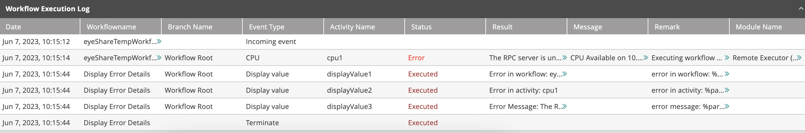
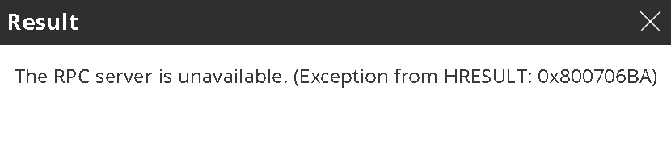

## About Testing and Running Your Workflow

The Workflow Designer provides the following options for validating your workflow and verifying that it will run as expected:

*   **Verification:** Performs a logic check on the workflow to determine if all components are valid. For details, refer to [Verifying Workflows](#UUID-bbf488df-afef-0d5d-41df-dc3a1a921fd1).
*   **Execution:** Runs the workflow and displays a log providing details related to the execution of each activity. For more information, refer to [Running Workflows](#UUID-d5bb5bfa-ce70-a05e-63ad-d410a79989d8).

## Verifying Workflows {#UUID-bbf488df-afef-0d5d-41df-dc3a1a921fd1}

The Verify function runs a validity check on a workflow to determine if all the components are defined correctly (e.g., activity settings are present and configured as expected). It is recommended to perform a verification check before saving or executing your workflow.

To verify a workflow:

*   On the left side of the relevant [workflow tab](../Workflow-Designer/Working-with-Workflows.mdx), click the three-dot menu and select **Verify**.  
    If all workflow components are valid, a confirmation message appears at the top of the screen.  
    If one or more components are invalid, an Error Log appears at the bottom of the screen. Each row of the Log displays the name of the component that failed verification and a description of the error involved.

## Running Workflows {#UUID-d5bb5bfa-ce70-a05e-63ad-d410a79989d8}

The Execute function runs a workflow and then displays a log providing information related to the execution of each activity. You can change the settings of the log to display more (or less) detail, as needed.

To run a workflow:

*   From the Designer toolbar, click the Run (play) icon .  
    The workflow is executed, and the execution log is displayed at the bottom of the screen.

:::note
To abort execution while the workflow is running, from the Designer toolbar, click the Abort (stop) button .
:::

:::note
To run the workflow with variables that have been set by using the **Set Variables** function, see [Running Workflows with Variables](#UUID-c4401331-1ba6-82d7-c718-3bfa1163a518).
:::

## Working With the Execution Log

The Execution Log, which is displayed at the bottom of the screen, shows the execution status and result of each activity in the workflow. The Log can be sorted according to any column, in either ascending or descending order. To hide the Log, in the upper right corner of the Log, click the collapse arrow.

Clicking the double arrow in the **Result** column opens a popup displaying complete result details. For example:

The **Result** may be more complex even including a complete table.

## Setting Variables in Workflows {#UUID-1013992b-c141-976f-6085-0be3cec985e2}

### Resetting Variables in Workflows

## Running Workflows with Variables {#UUID-c4401331-1ba6-82d7-c718-3bfa1163a518}

Once variables have been set (see [Setting Variables in Workflows](#UUID-1013992b-c141-976f-6085-0be3cec985e2)), clicking on the **Run** button from the **Workflow Designer** will display the **Set Values & Run** window.

Users with editing permissions have the option to select which variables to be used during the workflow execution while users without editing permissions must insert values for all required variables to execute the workflow.

