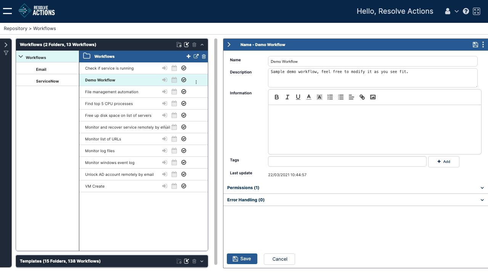
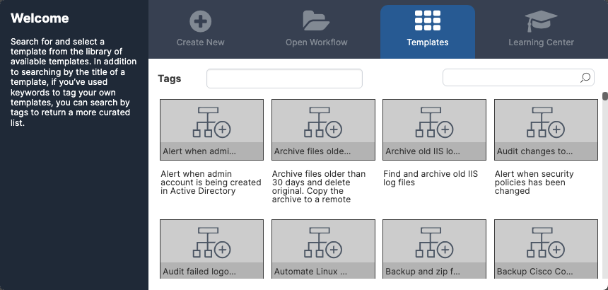
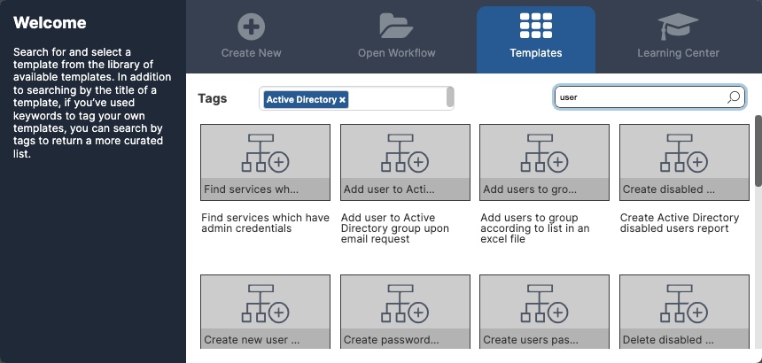

## Adding Tags to a Workflow {#UUID-5c157d9d-1ded-8d2b-4e9b-b85850b3032c}

Tags are keywords that are applied to a workflow. They are useful for organizing your collection of workflows and for helping users to quickly find a workflow.

Generally, tags are actions or categories that are relevant to a workflow. For example, appropriate tags for the workflow Monitor Windows Event Log would be Monitoring, Windows, Logs, and so on.

For convenience, the Workflow Designer offers a large selection of preconfigured tags. However, if you need tags that are not provided, you can easily create new tags and add them to the Tags list.

To add new tags to a new workflow:

1.  In the **Create New** screen, click **Add** next to **Tags**.  
    The **Add Tag** popup opens.
2.  Enter a name for the new tag in the upper field and then click **Add**.  
    The new tag appears in the lower field. Repeat to add as many tags as required.
4.  Click **Save**.  
    The new tags are saved in the system and added to the Tags list.
    :::note
    *   At any point, you can remove a new tag by clicking the X icon on the tag. You can remove all using the **Clear all** button.
    *   You will have the opportunity to add or remove tags when you save your workflow. See [Using the Save As Option](id::reviewing-and-sharing-workflows#UUID-5a736193-3494-0016-1db6-779cfd6f204e).

## Opening an Existing Workflow {#UUID-60e55c7c-530c-c69d-b6c7-27d48fcab2e6}

### Locating Existing Workflows

Opening a workflow involves displaying a previously saved workflow in the Designer so you can continue to build or edit it. You can open a saved workflow using any of the following methods:

*   **Re-open a recently opened workflow:** Involves selecting a workflow from a list on the **Welcome** screen. For details, refer to [Re-opening a Recently Opened Workflow](#UUID-9a16ebf8-59e9-f6fe-39d9-f68bc4e2bb87)
*   **Open a workflow from the Repository:** Involves selecting a workflow from the collection of all previously saved workflows. For more information, refer to [Opening a Workflow from the Repository](#UUID-2c3330b1-2a22-dc7f-6441-d10a1fe17e1e).
*   **Import a workflow into the Workflow Designer:** Involves selecting a previously exported workflow that is saved as an XML file. For more information, refer to [Importing a Workflow](#UUID-d6ddc503-4c1d-3774-f7c1-ab2398b65de9).
    
### Re-opening a Recently Opened Workflow {#UUID-9a16ebf8-59e9-f6fe-39d9-f68bc4e2bb87}

The Workflow Designer automatically tracks  the workflows that you have been working on. When you click the **Open Workflow** tab of the **Welcome** window, information about the workflows that you have opened most recently is displayed. Up to 10 workflows can be listed.

To re-open a recently opened workflow, from the **Open Workflow** tab of the **Welcome** screen, select the row of the required workflow, double-click it or just click **Open**.
    

    
The **Welcome** screen closes, and the selected workflow is displayed in the Workflow Designer.
    
### Opening a Workflow from the Repository {#UUID-2c3330b1-2a22-dc7f-6441-d10a1fe17e1e}

The Repository lists all previously saved workflows, regardless of who last saved them or when they were last opened. Use the following procedure to access a workflow from the Repository.

To open a workflow from the Repository:

1.  At the top of the **Open Workflow** tab of the **Welcome** screen, click **Open From Repository**.  
  The **Workflows** frame of the Repository opens.  
  
2.  In the left pane, choose a folder to open.
3.  In the right pane, click a workflow to select it.  
    Expand the collapsed panel on the right to see the workflow's details and settings.  
    
5.  In the upper right corner of the screen, click the tree-dot actions menu and select **Open**.  
    The selected workflow is displayed in the Workflow Designer.

### Importing a Workflow {#UUID-d6ddc503-4c1d-3774-f7c1-ab2398b65de9}

Workflows can be exported to XML files, so you can back up or share your work. Importing a workflow involves opening a previously exported workflow in the Workflow Designer.

:::note Export Format
Workflows are packaged in a ZIP archive when exported. The export can contain one or more workflows, stored as XML files named `<Workflow name>`.xml.

When importing workflows, you can import either the ZIP file or the XML file(s) found in it.

Unpacking the ZIP file can be useful when it contains multiple exported workflows, but you only want to import one.

In addition, each export contains a file named `workflows_export_summary.xml`. You can disregard this file when importing individual XML files.
:::

To import a workflow:

1.  Verify that the workflow you want to open has been exported and in XML file format.
2.  At the top of the **Open Workflow** tab of the **Welcome** screen, click **Import from file**.  
    The standard operating system file opening dialog is displayed.
3.  Choose the export file and then click **Open**.  
    The selected workflow is displayed in the Workflow Designer.  
    :::note
    If the workflow depends on a module instance that does not exist in the system, you are asked to select a replacement module instance that can provide the same functionality.
    
    Note that the module selection list will only show module instances for which you have [write permissions].
    :::

    :::caution
    Importing a Workflow that contains an Integration Module (e.g., AWS) requires manually remapping activities to modules. Without manual remapping, you will receive an error: "Integration module is not ready."
    :::

### Inserting Existing Workflows

VAR::PRODUCT_FULL scans the content of any workflows that you are importing to see if they don't already exist in the system. When the workflow that you are importing already exists, you have the option to:

1.  **Use existing workflow item** - Skips the import of this workflow and keeps the copy that is already in the system.
2.  **Keep both workflow items** - Import the workflow under a new name (ending in `_Imported`) to avoid any risk of overwriting content.
3.  **Overwrite workflow items** - Imports the workflow, completely overwriting the content of the matching workflow found in the system.
    
## Opening a Template {#UUID-675b8d6b-d2f6-1964-23bf-f8f480c61daf}

Templates are pre-built, customizable workflows that provide a foundation for building workflows for specific scenarios. The Workflow Designer offers a wide selection of templates, including suggested automation workflows for file management activities, service restarts, event log monitoring, and many other common processes. You may use a template as a starting point for designing your own version of a workflow, or you can include one or more templates as part of a larger workflow.

This section explains how to open a template from the **Welcome** screen of the Workflow Designer.

To open a template:

1.  At the top of the **Welcome** screen, select the **Templates** tab. Alternatively, at the bottom of the [Create New](#UUID-9be1b11d-eb69-9c59-322e-8c91084de4d3) tab, click **Search Templates**.  
    The **Templates** tab opens, listing all defined templates.  
    
2.  If desired, filter the Templates list using one or both of the following techniques:
    *   **Filter by tag:** Click in the **Tags** field and select tags that are relevant to the template you are looking for. For more information about tags, refer to [Adding Tags](#UUID-5c157d9d-1ded-8d2b-4e9b-b85850b3032c).
    *   **Filter by search term:** In the **Search** field, enter a term related to the template you are looking for, and then press **Enter**.
        
    The following example shows a Templates list that is filtered according to both the Active Directory tag and the search term _user_:
    
    
3.  From the Templates list, select the desired template.  
    The selected template is displayed in the Workflow Designer.