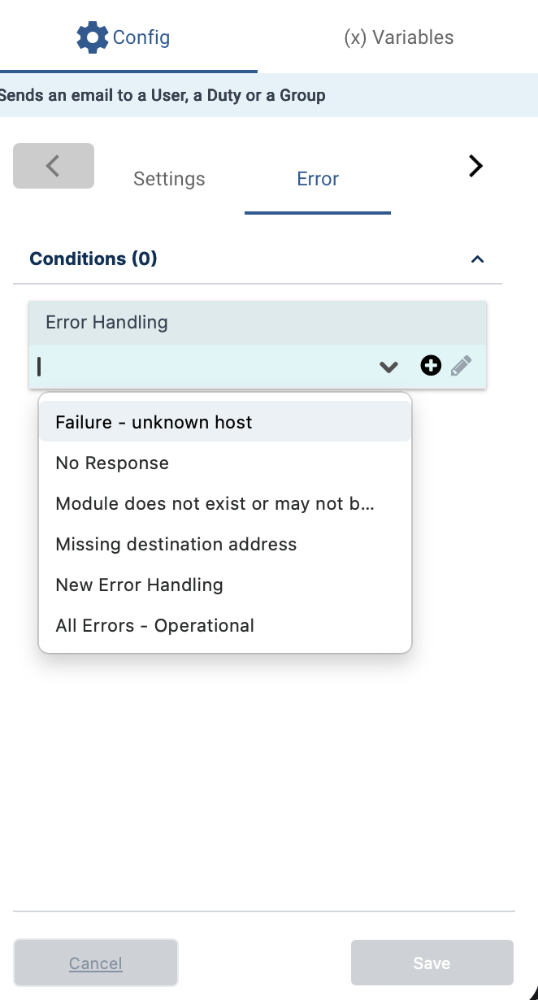
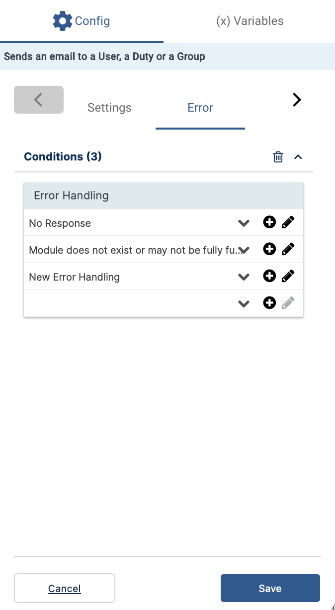

The **Error** tab in the Activity Details dialog allows you to specify what happens if the activity fails to execute. You can choose from four general handling categories using the dropdown list on the **Error** tab.

To assign multiple error handling options:
1. Open the dropdown list.
2. Select additional categories as needed.

The selected options are applied in the order they appear. For example:

It is recommended to define error handling for every activity, especially those that occur before critical steps in your workflow. 