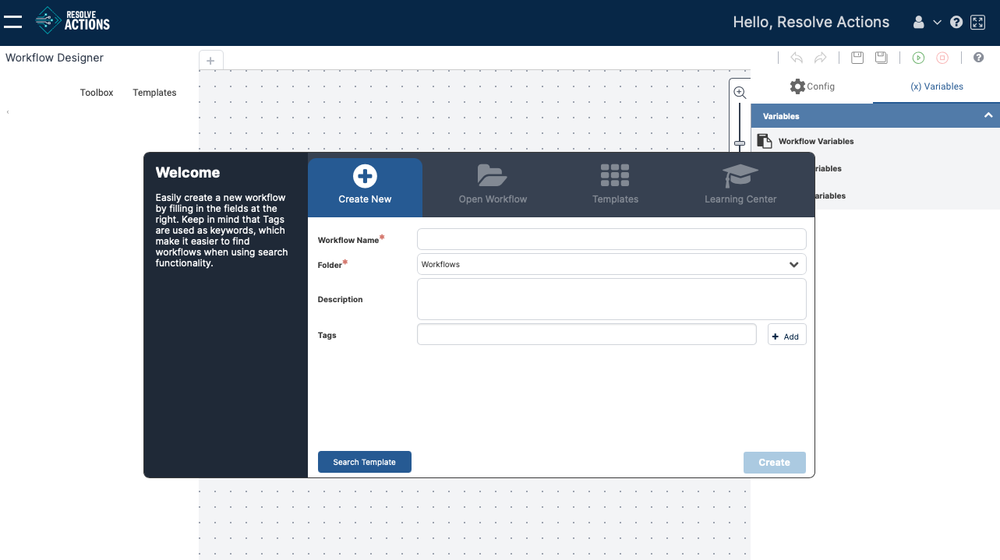
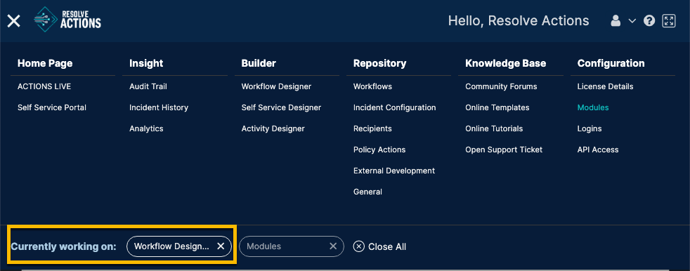
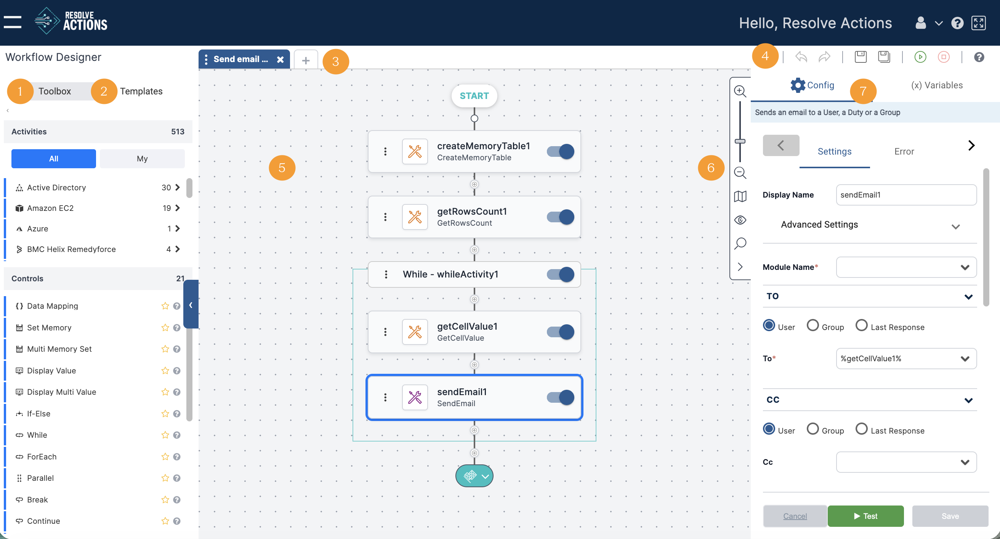
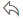
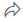
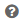

## Opening the Workflow Designer

Log in to VAR::PRODUCT_FULL and open the Navigation menu:

To open the Workflow Designer, open the **Main Menu** and then select **Builder > Workflow Designer**.

The Workflow Designer opens with a **Welcome** window:
    

    
:::note
For a short video tutorial on using the Workflow Designer, in the upper-right corner of the Welcome screen, click **Learning Center**.
:::

### Re-opening the Workflow Designer

If you last quit the Workflow Designer without closing the workflow(s) you were building, a **Currently working on** quick start bar appears when you next access the Designer from the Navigation menu. To launch the Designer and open a specific workflow at the same time, select the workflow from the quick start bar.

If you do not use the quick start bar and launch the Designer by clicking **Workflow Designer** (from the navigation menu), the Designer automatically opens with all previously open workflows displayed.

## Workflow Designer Main Window

This section presents the main components of the Workflow Designer main window and explains how to use them. In the figure below, the main components are numbered. A key is provided in the table following the figure.

##### 1 - Toolbox

Lists all the activities and controls that you can use in your workflow. For more information, refer to [Understanding the Toolbox](#understanding-the-toolbox).

##### 2 - Templates

Lists all the templates that you can add to your workflow. For more information, refer to [Using the List of Templates](./Workflow-File-Options/using-the-list-of-templates.mdx).

##### 3 - Workflow tabs

List the names of the workflows that are currently open. Clicking the plus icon opens the [Welcome screen](./Workflow-File-Options/open-workflow.mdx), from which you can create or open an additional workflow.

Clicking the three dots opens a further menu that allows you to perform the following actions:

* Documentation - [View and update description, tags, and notes](./verify-workflows.mdx)
* Verify - [Verify the workflow](./verify-workflows.mdx)
* History - [View revision history](../../Product-Navigation/Workflow-Designer/Workflow-File-Options/workflow-revisions.mdx)
* Export - [Export the workflow](./Workflow-File-Options/export-workflow.mdx)

##### 4 - Designer toolbar

Provides one-click access to common actions related to building a workflow. For details, refer to [The Designer Toolbar](#the-designer-toolbar).

##### 5 - Canvas

The drawing board of the Workflow Designer.

##### 6 - Reference toolbar

Provides viewing tools (such as resizing) the workflow layout and searching for workflow components. 

##### 7 - Activity Configuration sidebar

Provides a fixed module for Activity Configuration. For more information, see [Configuring Activities](../../Building-Your-Workflow/configuring-activities.mdx).

## Understanding the Toolbox 

The Toolbox offers two classes of resources that you can use to build your workflows:

* **Activities** are operative actions that make up the workflow process. An activity can be deleting a folder, adding a user, retrieving CPU data, and so on. In the Toolbox, activities are grouped according to category. Each category is represented by an icon (on the left side of the activity row).
* **Controls** are functions or logic expressions that determine the direction in which the workflow progresses. Examples include conditions and If-else controls.  

When you hover over an activity or a control, the following icons appear:

| Icon | Description |
|---|---|
|  | Toggle. Indicates that the activity or control has been removed from your Favorites list. |
|  | Toggle. Indicates that the activity or control has been added to your Favorites list. |
|  | Hovering over this icon displays a tooltip describing the activity or control. |

Both activities and controls can be added to the workflow by dragging and dropping them onto the canvas. For more information, refer to [Adding Activities](../../Product-Navigation/Workflow-Designer/Add-Activities/introduction-to-adding-activities.mdx).

## The Designer Toolbar 

This toolbar provides one-click access to actions that are frequently performed when building a workflow.

| Icon | Action | Description |
|---|---|---|
|  | Undo | Removes the last edit done to the workflow. |
|  | Redo | Restores the change that was last removed using the Undo action. |
|  | Save | Saves all changes made to the workflow since the last Save action. For details, refer to [Saving Your Workflow](../../Product-Navigation/Workflow-Designer/Workflow-File-Options/save-workflow.mdx). |
|  | Save As | Allows you to save the current workflow as an additional workflow or as a template. For more information, refer to [Saving Your Workflow](../../Product-Navigation/Workflow-Designer/Workflow-File-Options/save-workflow.mdx). |
|  | Run | Executes the workflow. For more information, refer to [Running Workflows](../../Product-Navigation/Workflow-Designer/run-workflow.mdx). |
|  | Abort | Stops execution of a running workflow. |
|  | Help | Opens the online help for the Workflow Designer. |