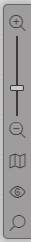
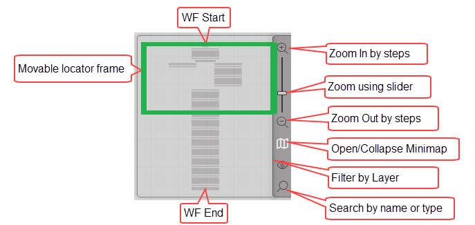
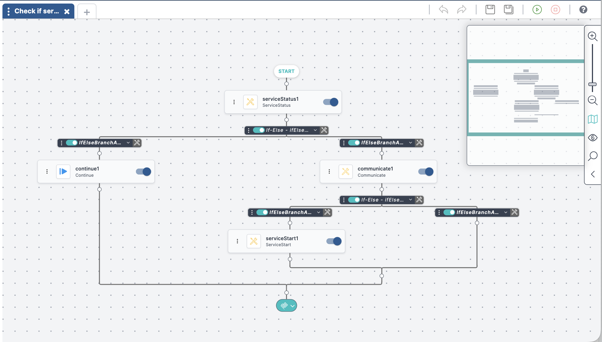
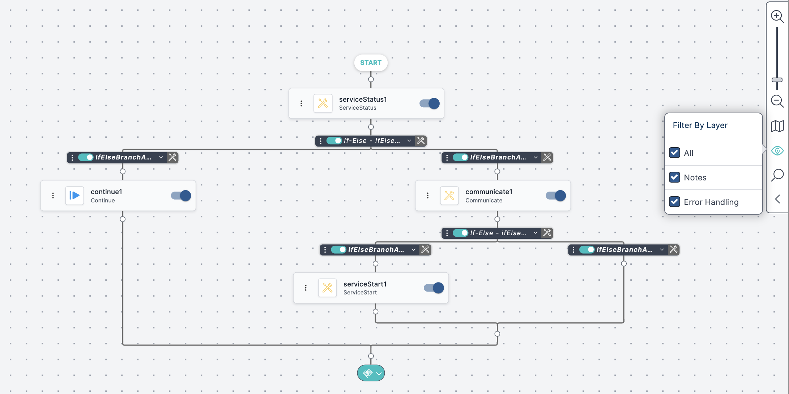

## Navigation Tools

The Reference toolbar, in the upper-right corner of the Workflow Designer, offers tools for viewing your workflow layout and locating specific components. In normal operation, the toolbar appears as follows:

Clicking the Minimap icon  opens a view of the entire workflow:

A movable green locator frame lets you focus on a specific portion of the workflow:

To move around the workflow, click and drag the orange box in the Minimap. As you move the box, the visible portion of the canvas updates in real time. This is useful when working with workflows that are too large to fit on the screen.

The Reference toolbar includes the following tools:

| Icon | Tool | Description |
|---|---|---|
|   | Zoom In/ Zoom Out | Increases or decreases the zoom level on the canvas. |
|  | Minimap | Shows a compact visual overview of the entire workflow, allowing easy navigation to different areas. |
|  | Filter By Layer | Highlights workflow components that include notes and/or error handling. . |
|  | Search Activity | Finds activities within the workflow using keyword searches. |

## Adjusting the View Using Zoom 

Use the **zoom tool** to change the size of the workflow view on the canvas.

- Click the **plus icon** to zoom in and focus on smaller areas or individual components.
- Click the **minus icon** to zoom out and view more of the workflow layout. 

You can drag the zoom slider for faster control.

You can adjust zoom by scrolling while the mouse pointer is inside the Minimap.

## Working with the Minimap

For large or complex workflows, the **Minimap** is an essential navigation tool that helps you stay oriented and quickly reach the sections you need. 

The Minimap shows a small diagram of the entire workflow. The current visible area is marked by the **orange locator frame.**

You can navigate the workflow using either method:

*   **Drag the locator frame** inside the Minimap to reposition the canvas view.
*   **Drag the canvas** directly within the Workflow Designer to reposition the locator frame in the Minimap.

To hide the Minimap, click the map icon: 

## Filtering Workflow Components 

The **Filter By Layer** feature highlights workflow components that contain:

*   **Notes:** Additional comments or context about a component.
*   **Error Handling:** Instructions about actions to take if a component fails or encounters an issue.
    
The example below shows a workflow filtered to highlight components that include notes. Highlighted components appear in full color. Others are grayed out.

:::note
Grayed-out components are still active and editable. They will function as normal when the workflow runs.
:::

To filter the workflow:

1.  Click the **Filter** icon on the Reference toolbar..  
    The **Filter By Layer** popup opens.  
2.  Uncheck **All**, then select **Notes** and/or **Error Handling** to apply specific filters. 

## Locating Activities Using the Search Tool {#UUID-e15a17f7-dd70-accb-11f9-bab206fdd779}

The **Search** tool lets you find workflow activities by name or type using a keyword search.

You can enter:

- The full or partial **activity instance name**
- The **activity type**

Match results are highlighted in the workflow, allowing quick access to the activity you're looking for.