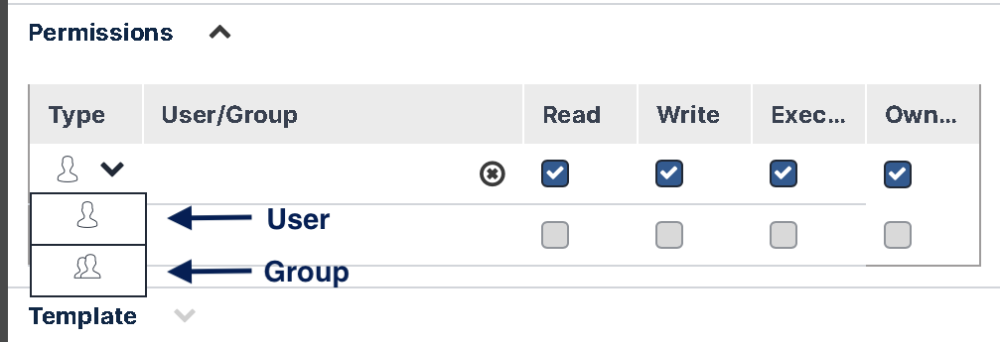

### Assigning Permissions to a Workflow

Every workflow has one or more Owners and a set of permissions associated with it. An Owner is a user who manages permissions for the workflow. The set of permissions defines which users are allowed to access the workflow, and what actions they are authorized to perform on it.

The **Permissions** frame of the **Save As** dialog enables workflow Owners to manage the permissions set for the workflow. Users/Groups that have permissions to access the workflow are listed on the left side of the frame. The permissions categories for which they are authorized are indicated on the right side of the frame.

:::note
Permissions are not relevant for templates.
:::

Permissions categories are named according to actions. The categories are:

* **Read**—Users are authorized to view the workflow in read-only format.
* **Write**—Users are authorized to view and modify the workflow.
* **Execute**—Users are authorized to execute the workflow. By default, these users are also automatically granted Read privileges, but not Write privileges.  
   If an Owner removes Read permissions from a user with Execute permissions, that user may execute the workflow only from outside the Workflow Designer.
* **Owner**—By default, Owners have Read, Write and Execute privileges. They also may manage the permissions set and delete the workflow. By default, the creator of a workflow is the Owner.  
   An Owner may add and remove additional Owners and remove Owner permissions from other Owners. A workflow must have at least one Owner at any given time.

The following procedures explain how to manage the permissions set from the **Save As** dialog. Only Owners are authorized to manage the permissions set.

To add users/groups to the permissions set:

1.  From the **Type** dropdown, select the relevant icon (User or Group).  
    
2.  In the **User/Group** column, select the required user or group from the dropdown list.
3.  Select the checkbox(es) of the permission(s) to be granted to the user or group.
    A workflow can have more than one owner.  
    :::note
    Keep in mind that permissions granted to a user can be direct (permissions granted to the individual user) or indirect (permissions granted to groups of which the user is a member). For example, if a group has Write privileges, and User A (a member of that group) is added and assigned only Read privileges, User A will have both Read and Write privileges.
    :::
4.  To add another user or group, repeat the steps so far.

To remove a user or a group, click the X icon in its row.
    
