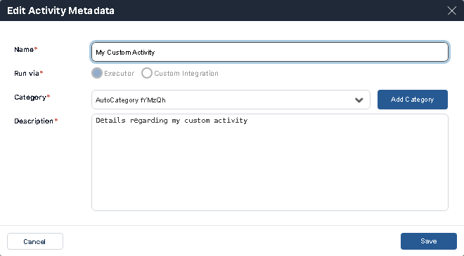

The top bar of the Activity Designer combines the tab bar that you can use to switch between open activities, and the toolbar that gives you a variety of actions that can be performed on the activity displayed on the canvas. Only one activity at a time can be displayed on the canvas.

## View Activity Metadata

The Activity Metadata allow you to change the activity instance name, category, and/or description. This will change the metadata on the existing activity.

To access the Activity Metadata, click the three-dot menu on the activity's tab and select **Edit**.

## Save

Click the single floppy-disk icon on the toolbar.

This will save the existing activity shown on the canvas. If this is the first time saving a newly created/imported activity, **Save** will work the same as **Save As**.

Changing an activity that is currently used in a workflow will impact any workflow that contains this activity.

## Save As

Click the double floppy-disk icon on the toolbar.

**Save As** will save a new version of the activity with a new name in case the activity instance name has been changed. The existing version of the activity will remain with the old name, a new copy will be saved with a new name.

## Run Workflow

Click the green play button on the toolbar.

**Run Workflow** will debug your activity within the Activity Designer. Ensure all required fields are filled in the *Activity preview*, then click **Run Workflow**. The **Workflow Execution Log** will appear at the bottom of the screen, indicating the *Status* and *Result* of the workflow.

## Export

Click the outbound arrow icon on the toolbar.

Exports the activity currently open on the canvas.

*   Activities can only be exported after they are saved at least once.
*   If changes are made since the last save, only the last saved version will be exported without any of the unsaved changes
*   Exports will be in .ayh file format and be a zipped folder which includes a code file (.CS, .VB, or .PY depending on code), a JSON file (.json), and a metadata file (.XML).
    
## Import

Click the inbound arrow icon on the toolbar.

Imports a custom activity in the form of a .ayh file. For more information, refer to [Actions on Activities](./Importing-Activities.mdx).

## Delete

Click the trash can icon on the toolbar.

A custom activity can be deleted only if it is not currently used in any workflow.

If an activity is being used in any workflows, a message to this effect is displayed, and the activity is deleted.

First delete the activity from any workflows that contain it, and then from the Activity Designer.

Deleted activities cannot be restored.