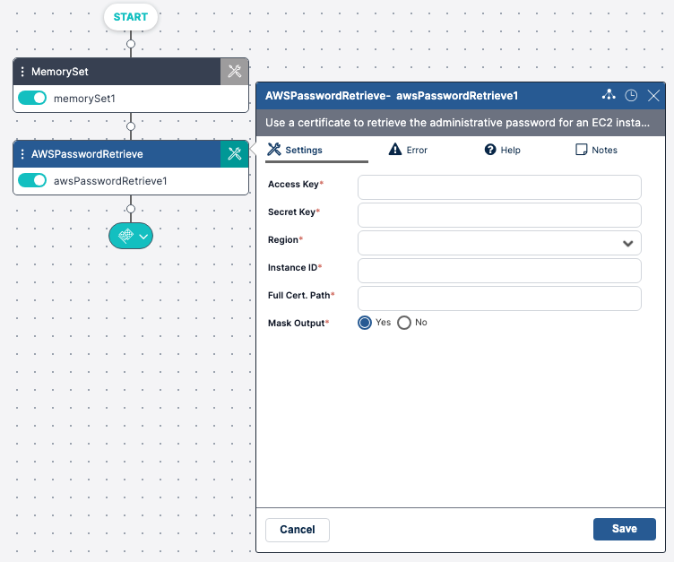

Use Custom activities in any workflow in the same manner as the out-of-the-box Resolve activities. Additionally, these activities have several distinguishing characteristics that make it easier to see that they are custom.

## In the Workflow Designer

Within the workflow designer a **custom activity** is marked as such in the following places.

## In the Workflow Toolbox

Custom activity categories will all be denoted by an orange category color and a wrench icon.

Note that if a custom activity category does not have any **enabled** activities in it, the category itself will not show in the Workflow Designer.

## On the Workflow Canvas

A custom activity added to the workflow designer canvas will show the activity with a distinct blue color across the top of the activity block and activity settings.

## In the Execution Log

When running a workflow in the workflow designer, any custom activities included in that workflow will show a **(custom)** label next to their **Activity Name** in the **Execution Log**.

## In the Audit Trail

When viewing the workflow **Activity Log** in the **Audit Trail**, the **Activity Name** will be followed by **(custom)** for all custom activities.

## In the Workflow Export

When exporting a workflow, the XML will note any custom activities included in that workflow.