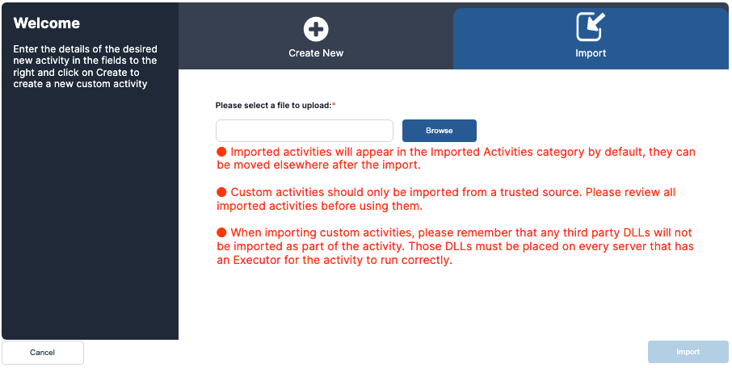

If you have a custom activity that was created in a different environment or an activity [downloaded](../../Product-Navigation/Workflow-Designer/Add-Activities/importing-activities-from-exchange.mdx) from the [VAR::EXCHANGE](https://exchange.resolve.io/), you can import it into your current environment.

The VAR::EXCHANGE offers a browsable, searchable, web-based library of pre-built automations and integrations that make it quick and easy to jumpstart and scale automation initiatives with no scripting or coding required.

Importing allows you to transfer activities between various environments such as dev, test, QA, or prod, or to implement activity backups.

If this is your first time entering the Activity Designer, or if there are no activities already created, the **New Activity** dialog box will automatically appear.

When you click the **Import** tab, you will have the ability to select the file to upload.

If you already have custom activities in the Activity Designer, click **Import activity** in the left navigation to import activities.

Imported files must be the .zip file that was exported from the source system or a .ayh file from the .zip export.

*   Imported activities appear in the **Imported Activities** category. You can move them to other categories as desired.
*   You should only import custom activities from trusted sources and review them prior to using them in a workflow.
*   When importing custom activities, any third-party DLLs are not imported as part of the activity. For the activity to run correctly, you need to place these DLLs on every server that has an Executor.
*   The .ayh file is a ZIP archive with a different extension. It must contain a code file (.cs, .vb, or .py), a JSON file (.json), and a metadata file (.xml) for the activity to be successfully imported and used.

Click **Browse** to select a file, then click **Import** to import the activity.

:::note
The activity is not imported if another activity with the same name already exists in the system.
:::

