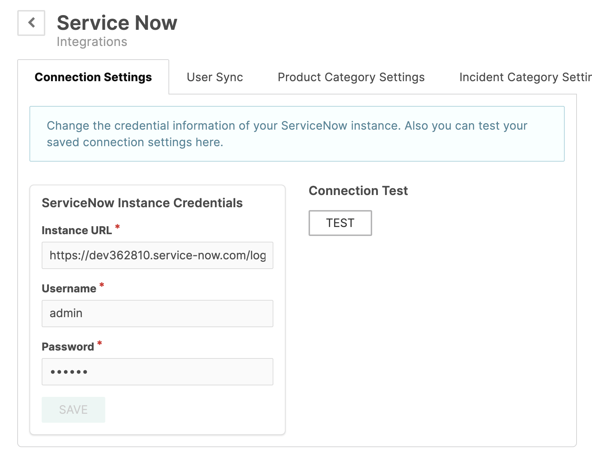
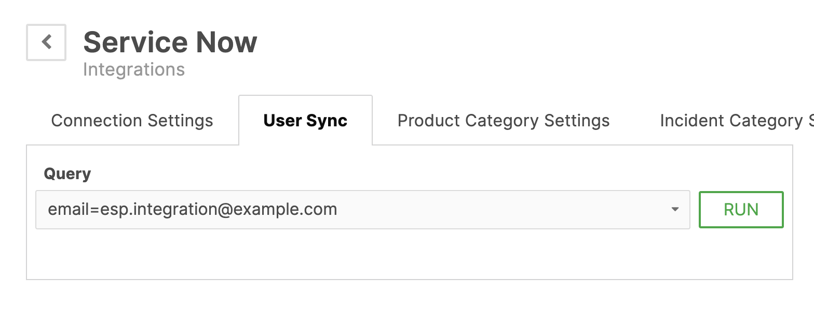
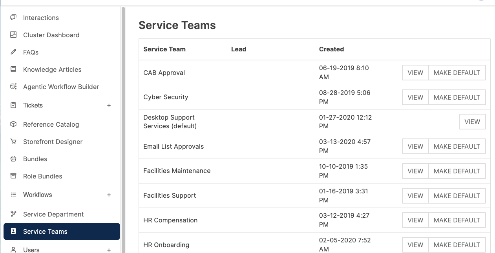
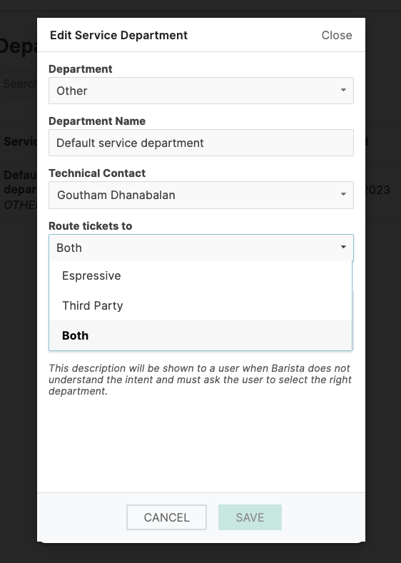

## Connect Barista to ServiceNow

:::note
All steps in this section are performed by a Barista Admin.
:::

### Navigate to Connection Settings

1. Login in as a Barista Admin at `{tenant}.espressive.com/admin`.  
2. Select the **Integration Hub** from the side panel. 
3. Hover over the **ServiceNow** card and click **Configure**.  
4. Click the **Connection Settings** tab.

#### Configure Connection

1. Enter the following:
   - **ServiceNow Instance URL:** `https://[instance].service-now.com`  
   - **Username:** `esp.integration`  
   - **Password:** `[password from Configure ESP Integration User step]`  
2. Click **Save**.

#### Test Connection

1. Click **Test** button next to the **Connection Settings**.
2. Wait 5-10 seconds.  
3. Verify the success message appears.

:::note
If the test fails, wait 1-2 minutes and retry. If the connection is still unsuccessful, verify that all previous steps were completed correctly.
:::

### Sync ESP Integration User

1. Navigate to the **User Sync** tab.
2. In the **Query** field, enter the email used for the `esp.integration`. (Example:`email=esp.integration@example.com`)
3. Click **Run**.  
4. Review verification and click **Yes**.  
5. Wait 10-20 seconds for the sync to complete.

#### Configure ESP User in Barista

1. Go to **Users > List** as a Barista Admin.  
2. Search for `esp.integration`.
3. Click **View** to display user details.
3. Click **Edit**.  
4. Configure the following:
   - **Administrative Permissions > Role:** `Admin`  
   - **Control Center Authentication > Password:** `[same password as ServiceNow]`  
5. Click **Save**.

### Configure Service Teams and Department

#### Add Service Teams

1. Click **Service Teams** in the left menu as a Barista Admin.  
2. Locate **Default service team** and click **View**. You may notice that some service teams have a **Make Default** option, while one only has a **View** option. The service team that only has the **View** option is the current default service team.
3. Click the **Team Members** tab.  
4. Click **Invite Member**, search by name, and select the role (**Service Lead** or **Service Agent**).  
5. Click **Save**.  
6. Repeat for additional team members as needed.

#### Configure Routing in Barista

1. Click **Service Department** in the left menu as a Barista Admin.  
2. Locate **Default service department** and click **Edit**. *The default department is the one that cannot be deleted.*
3. Configure routing:
   - In the **Route tickets to:** dropdown select `Both`  
   - **Technical Contact:** select a technical contact or the ESP integration  
4. Click **Save**.  
5. If unable to save, ensure a technical contact is selected.

:::note
**Both** routing creates a local ticket in Barista and a corresponding ticket in ServiceNow, allowing tracking in both systems.
:::