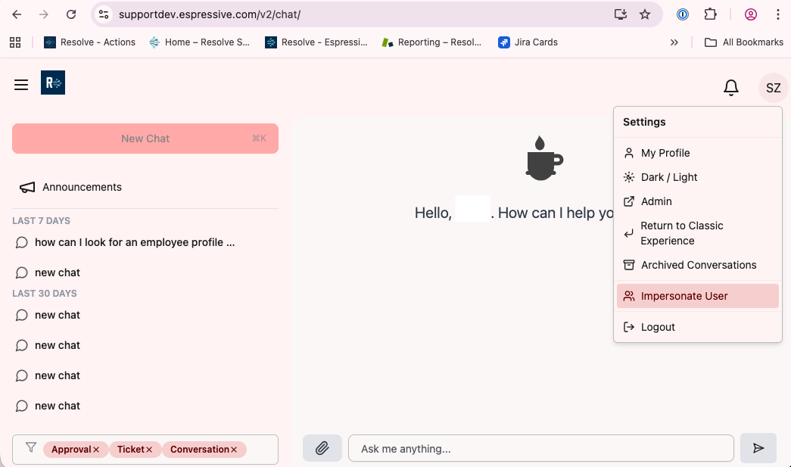

### Prerequisites

- ServiceNow users synced in Barista . 
- Users have permission to create/manage incidents in ServiceNow.

### Verify Users Synced

1. Go to **Users > List**.  
2. Confirm ServiceNow users appear.  
3. If not, repeat **User Sync**:  
   **Integration Hub > ServiceNow > User Sync** > enter `active=true` > **Run** > confirm.

#### Enable User Impersonation

1. Go to `{tenant}.espressive.com/status`.  
2. Navigate to **Display Settings**. 
3. Scroll down to **Barista chat**.
4. Enable the toggle **Barista For Agents To Use Barista On Behalf Of Employee**.
5. Navigate to **Users > List** from the side panel menu.
6. Search for the username: `esp.integration`.
7. Click **View**.
8. Click **Edit**.    
9. Click **Administrative Permissions and in the **Role** field add `Agent`.
10. Click **Save**.

:::note
Repeat the process for any usernames that will need to impersonate users.
:::

#### Test Incident Creation

1. Navigate to https://[tenant].espressive.com/v2/chat or navigate to https://[tenant].espressive.com.
2. Click on **Get Help**.
3. For Chat v2, click on your initials, and select **Impersonate User**. For classic Barista, select **Options > Impersonate User**, 
3. Ask a question in chat and request ticket creation.  
4. Verify:
   - Incident is created  
   - Incident bar appears at top with details  
   - Link to ServiceNow ticket is visible

#### Test Incident Management Features

1. Start a new chat.  
2. Ask to "see all open tickets" or "ticket statuses".  
3. Verify that tickets are displayed.  
4. Click a ticket card and verify:
   - Ticket details are correct  
   - Options to cancel, escalate, resolve, comment and attach file are available. 
5. Add a comment through the chat.  
6. Go to ServiceNow and verify the comment is visible

:::tip
Customer-specific field mappings and additional incident options can be configured by contacting your customer service representative to verify **Doppio > Integrations > ServiceNow**. 
:::