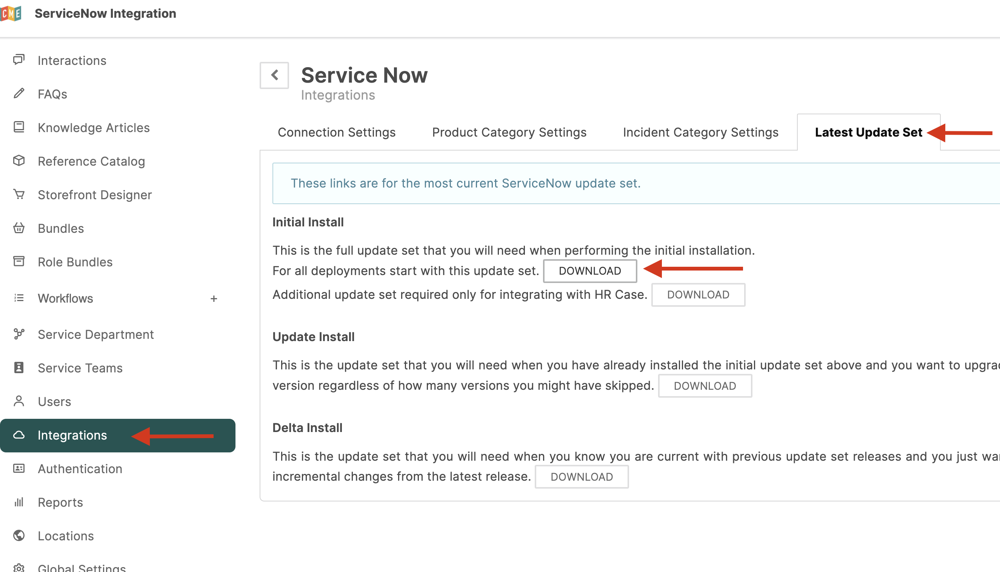

### Download ServiceNow Update Set

:::note
All steps in this section are performed in Barista.
:::

1. Login to `{tenant}.espressive.com/admin`.
2. Click **Integration Hub**.
3. Locate the **ServiceNow** card.
4. Click **Configure**.

#### Download the Update Set

1. Click the **Latest Update Set** tab.
2. Under **Initial Install**, select **For all deployments start with this update set**.
3. Click **Download**.

The file is saved locally as `install.xml`.

### Install ServiceNow Update Set

:::note
All steps in this section are performed in ServiceNow. Steps may vary slightly depending on your ServiceNow version.
:::

#### Import the Update Set

1. Login to `https://[instance].service-now.com` as an Administrator.
2. Navigate to **Retrieved Update Sets**.
3. Click **Import Update Set from XML**.
4. Click **Choose File** and select `install.xml`.
5. Click **Upload**.

#### Preview and Commit

1. Find the uploaded file in ServiceNow.
2. Click **Preview Update Set**.
3. Wait for the preview to complete and verify there are no errors.
4. Click **Commit Update Set**.

#### Verify ESP Modules

1. In ServiceNow, search for **ESP**.
2. Confirm the following modules are available:
   - **Espressive > Integration Settings**
   - **Espressive > Integration Hub**

:::note
The update set installs in the correct application scope automatically. If you encounter scope-related errors, verify the file was not modified before import. If needed, re-download and upload a clean copy.
:::