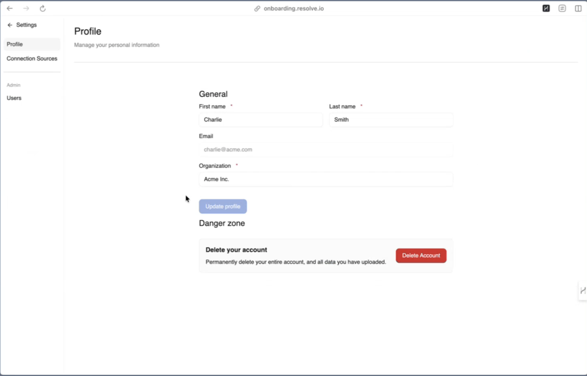

---

id: admin-settings
title: Admin Settings
description: This explains how to access and navigate the Rita Go Admin settings menu and dashboard.
sidebar_position: 10
keywords: [getting started, dashboard, administration, RitaGo]
tags: [getting-started, dashboard, navigation]
users: true # PERMISSION: Set based on target user and product tier
admin: true # PERMISSION: For admin-only content. Both users and admin can be true
trial: true # PERMISSION: For trial user content
premium: true # PERMISSION: For premium user content
enterprise: true # PERMISSION: For enterprise user content
---

# Admin Settings

import FeatureBadges from '@site/src/components/FeatureBadges'

<FeatureBadges />

To open the Admin Settings, click the ^ arrow in the bottom-right corner to expand the menu.

## Settings Menu

The expanded menu includes:

- Your current service level and the option to upgrade
- A link to **Settings**
- A link to **Help documentation**
- The **Log out** option

## Settings Dashboard

The Settings Dashboard opens by default to your **Profile** settings. 

The left-hand menu includes navigation options for:

- **Connection Sources**: for more information, see [Connection Sources Overview](../Knowledge-Base-Management/Connection-Sources/connection-sources-overview.mdx).
- **Users** (Admin users only): for more information, see [User Management Overview](../User-Management/user-management-overview.mdx).

