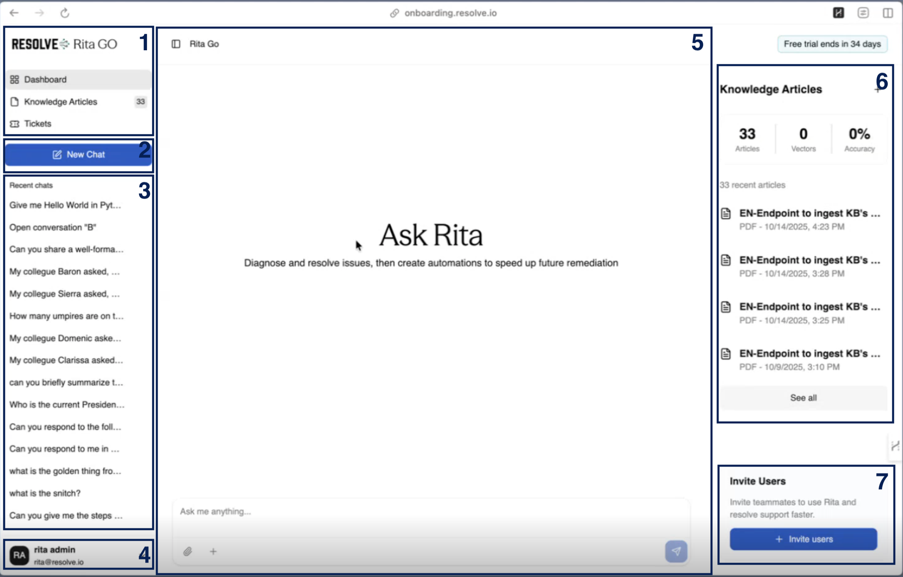

import FeatureBadges from '@site/src/components/FeatureBadges'

<FeatureBadges />
Once logged in, you will land on your **RITA Go dashboard**.

The main dashboard includes the following sections:

|Section|Description|
|------|---------|
|1| **Main Menu**: links back to the *Dashboard*, the **Knowledge Articles** dashboard, and **Tickets**.|
|2| **New Chat**: starts a new chat or refreshes the main chat.|
|3| **Recent chats**: displays the most recent 15 chats for the logged-in user.|
|4| **User Icon**: opens the user settings page.|
|5| **Rita Go Chat Interface**: the main chat area, where you can use the *Ask me anything* prompt to start or continue a chat and upload attachments.|
|6| **Knowledge Articles** sidebar: shows metrics for existing articles, vectors, and accuracy percentage. It also lists recent articles and provides an option to *See all* articles.|
|7| **Invite Users** button: allows administrators to invite additional teammates to the Rita Go instance.|