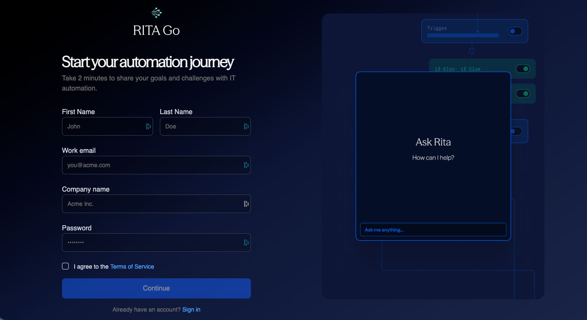

import FeatureBadges from '@site/src/components/FeatureBadges'

<FeatureBadges />
To sign up for Rita Go as an administrator, visit (LINK). 

:::note
Users of an organization must receive an invite from an administrator. For information on adding users, please see [Adding Users](./add-users). For information on logging in as an individual user, please see [Logging In](./logging-in).
:::

On the sign-up screen, fill in:

- **First Name** and **Last Name**
- **Work Email**
- **Company Name**
- **Password**
- Agree to **Terms of Service**
- Click **Continue**

