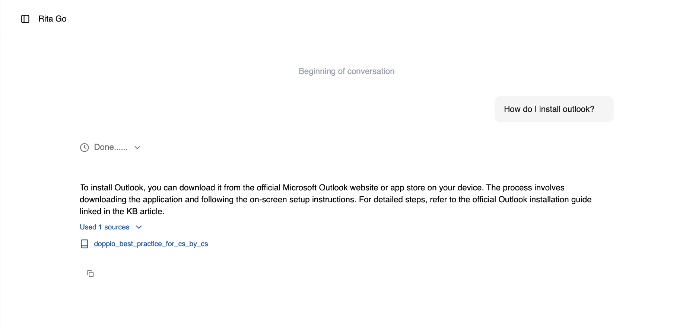

import FeatureBadges from '@site/src/components/FeatureBadges'

<FeatureBadges />
Once you have *Processed* documentation in your knowledge base, click the **New Chat** button. 

When asking Rita Go questions, responses are limited to the information in the knowledge articles you have uploaded. 

:::tip
When inviting additional users to your instance of Rita Go, ensure that you have shared the topic of the knowledge articles in your instance. Users will not be able to see the list of knowledge articles.
:::

### Responses
When Rita Go responds, a citation will appear. Clicking the citation allows you to review the vectorized document. 
