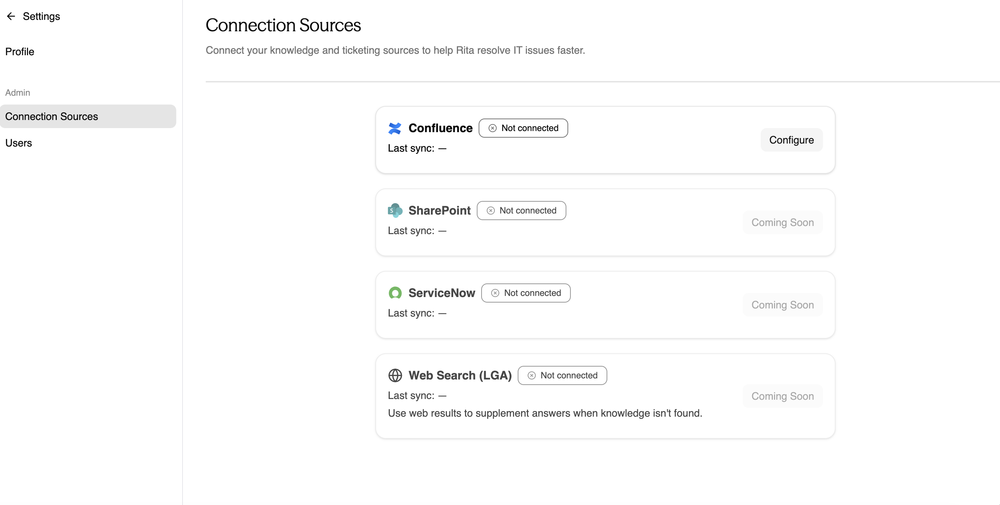
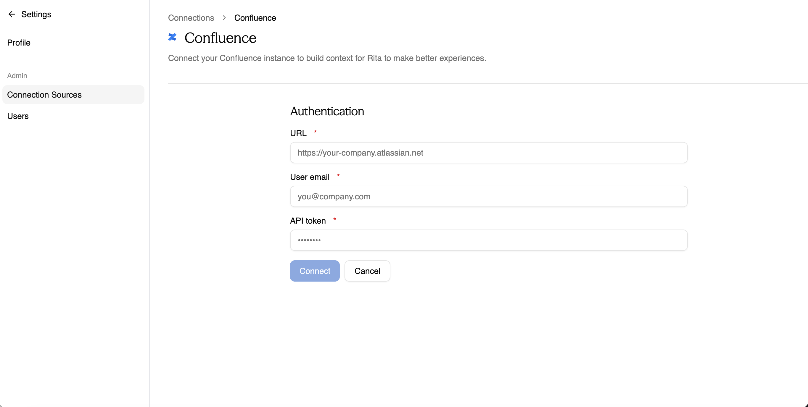
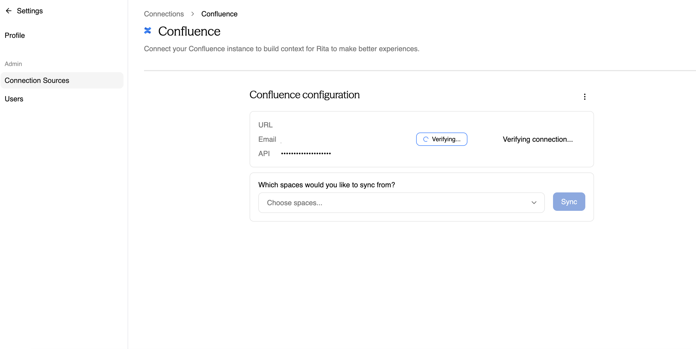

import FeatureBadges from '@site/src/components/FeatureBadges'

<FeatureBadges />
Your Rita Go instance can automatically pull content from existing Confluence documentation. To sync with Confluence, you will need to generate an API token in your Atlassian account. 

To add this information to Rita Go:

1. Navigate to **Settings > Connection Sources**.
2. Click **Configure** in the Confluence tile.

3. On the **Authentication** page:
  - Add your company's Atlassian URL.
  - Enter your User email.
  - Enter your API token. (For more information about generating an API token, visit [Manage API tokens for your Atlassian account](https://support.atlassian.com/atlassian-account/docs/manage-api-tokens-for-your-atlassian-account/))

4. Click **Connect**.
5. Select spaces to sync under *Which spaces would you like to sync from?*

6. Click **Sync.**

:::note
Each document in your Confluence space will count as an individual document towards your total knowledge article database.
:::