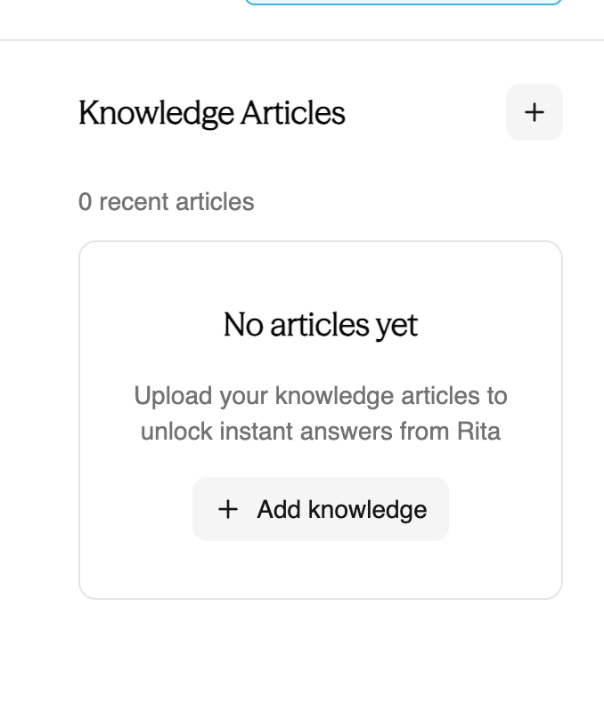
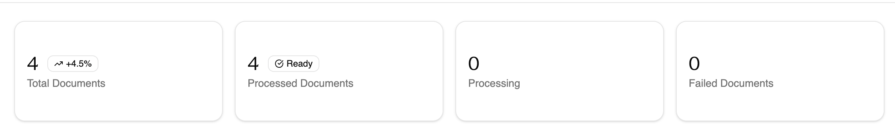
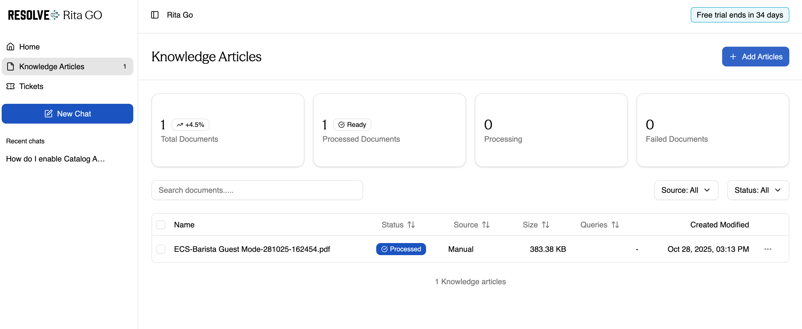

## Adding KB Articles to Rita Go from Homepage

Adding Knowledge to Rita Go is only possible with the **Administrator** role. Non-admin users will not see the sections as displayed in this KB.

1. Open your **Rita Go** tenant
2. From the homepate, click on the plus (+) sign next to **Knowledge Articles** in the side panel. A finder window will be displayed prompting you to select the file you want to add.
3. Once you have selected your file, click on **Open** and after processing, you will be able to see your document in the same section

## Adding KB Articles to Rita Go from Knowledge Articles Section
1. Open your **Rita Go** tenant, and select **Knowledge Articles** from the left side panel menu. You will be redirected to the **Knowledge Articles** section.

2. At the top of the page, you will find the **Add Articles** button. Click to add a new document.
3. You will be prompted to select a document from your PC. Slect the file, and click on **Open** when done.
In this section, you will be able to monitor the progress of multiple documents, identify the sources, and have a clear overview of what is being uploaded.

The **Knowledge Articles** section in Rita Go allows you to view:
- **Total Documents:** Total amount of documents uploaded to Rita Go. The icon next to the number will display a percentage of documents uploaded in comparison to average activity.
- **Processed Documents:** Out of the documents uploaded, this metric will display the amount of documents already processed and vectorized by Rita Go. The icon next to the number will display the status of the upload. If no upload is in progress, it should appear as **Ready**
- **Processing:** Amount of documents selected to upload that are still being ingested and vectorized by Rita Go.
- **Failed Documents:** If out of the documents selected for upload, one or more have failed, this metric will display the amount of failed documents. To see more detail on these, you can use the search bar, to find the documents in which the **Status** appears as *Failed*. 