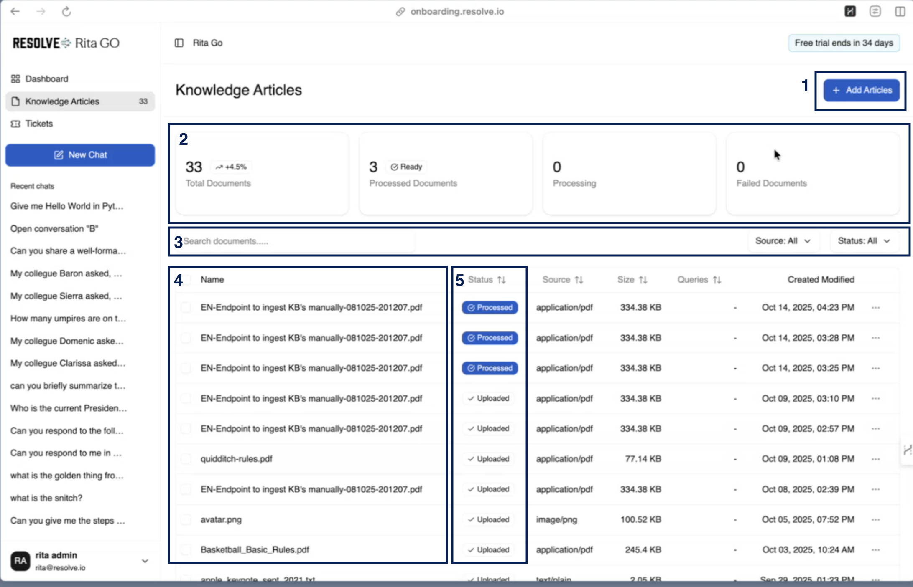

import FeatureBadges from '@site/src/components/FeatureBadges'

<FeatureBadges />
Click the **Knowledge Articles** menu item on the left-hand side of the main dashboard to open the **Knowledge Articles Dashboard**.

|Section|Description|
|------|---------|
|1| **Add Articles**: opens a folder on your local drive to select files for upload.|
|2| **Metrics**: displays basic metrics for the knowledge article database.|
|3| **Search and Sort**: provides options to search and sort knowledge articles.|
|4| **Name**: lists the names of all knowledge articles.|
|5| **Status**: shows the current status of each article's conversion to markdown and ingestion.|
